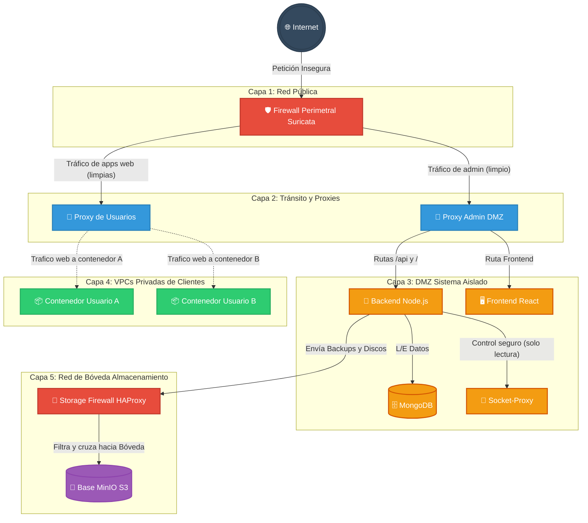
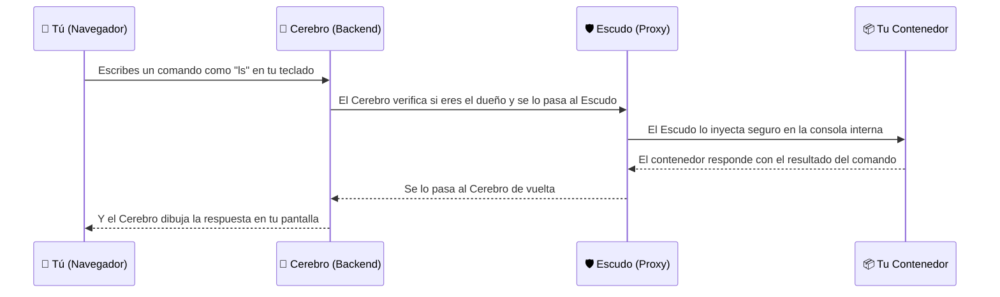

# 🐳 DockerManager: Plataforma CaaS/PaaS con Aislamiento VPC

DockerManager es una solución integral de "Contenedores como Servicio" (CaaS) diseñada para entornos multi-tenant. Permite a usuarios y organizaciones aprovisionar, gestionar y exponer aplicaciones Docker de forma segura, bajo un modelo de **Defensa en Profundidad** que combina aislamiento de red de Capa 2, inspección de tráfico perimetral y políticas comerciales automatizadas.

---

## 🔧 Entornos: `docker-compose.yml` vs `docker-compose.override.yml`

El proyecto usa **dos ficheros Compose** que Docker fusiona automáticamente al ejecutar `docker compose up`:

```
docker-compose.yml          ← Definición base (producción)
docker-compose.override.yml ← Sobreescritura local (desarrollo)
```

### ¿Cómo funciona el override?

Docker Compose tiene un comportamiento incorporado: si existe un fichero llamado exactamente `docker-compose.override.yml` en el mismo directorio, **lo carga y fusiona automáticamente** con el fichero base sin que tengas que especificarlo. Es el equivalente a hacer:

```bash
docker compose -f docker-compose.yml -f docker-compose.override.yml up
```

Las reglas de fusión son:
- Las claves que existen en el override **sobreescriben** las del base.
- Las que no existen en el override **se heredan** del base sin cambios.
- Las listas como `ports` o `volumes` se **concatenan** (se añaden, no se reemplazan).

### ¿Por qué separar los dos ficheros?

| | `docker-compose.yml` (Base) | `docker-compose.override.yml` (Dev) |
|---|---|---|
| **Propósito** | Producción / CI | Desarrollo local |
| **Backend** | Imagen compilada, sin hot-reload | `npm run dev` + hot-reload |
| **Frontend** | Nginx sirviendo el build | Vite dev server con HMR |
| **MinIO** | Sin puertos expuestos al host | Puerto `9001` expuesto (consola web) |
| **Volúmenes** | Solo los de datos | + bind mounts del código fuente |

### Flujo de trabajo

```bash
# Desarrollo (carga base + override automáticamente)
docker compose up -d

# Producción (solo el fichero base, ignora el override)
docker compose -f docker-compose.yml up -d

# Ver la configuración fusionada final que se aplicará
docker compose config
```

> [!NOTE]
> El fichero `docker-compose.override.yml` **nunca debe subirse a producción**. En un pipeline CI/CD, especifica explícitamente `-f docker-compose.yml` para ignorarlo.

> [!TIP]
> Puedes crear ficheros adicionales para otros entornos: `docker-compose.staging.yml`, `docker-compose.test.yml`, etc., y cargarlos manualmente con `-f`.

### ¿Por qué los contenedores de clientes no salen agrupados en Docker Desktop?

Visualmente, la interfaz de Docker Desktop (o Portainer) agrupa bajo una misma "carpeta" aquellos contenedores levantados desde un mismo archivo Compose, detectándolos mediante la etiqueta interna `com.docker.compose.project`.

Al aprovisionar la infraestructura del cliente desde el panel web, los nuevos contenedores son creados dinámicamente por el **Backend de Node.js invocando directamente a la API pura de Docker**, y no invocando a Docker Compose. Al carecer de dicha etiqueta, el gestor visual los dibuja por separado como instancias independientes.

Este diseño está hecho **de forma completamente intencionada para garantizar la resiliencia**: al dejarlos fuera de la agrupación de compose, garantizamos que ejecutar un comando administrativo global como `docker compose down` para reiniciar los servicios core de DockerManager **no destruya de forma accidental** los contenedores en producción de los usuarios. El ciclo de vida de los contenedores alojados está gestionado estrictamente por la lógica del Backend y el servicio Reaper.

---

### 🖥️ Desarrollo Local vs Producción 

Es importante entender que toda la compleja arquitectura de red y seguridad detallada en este documento **no es un esquema teórico reservado solo para grandes servidores en producción: ya está sucediendo en tu ordenador local** mientras programas.

Para que te hagas a la idea, esto es lo que está pasando en **tu propio Docker Desktop (Local)** contra cómo será en **Producción**:

🟢 **Lo que es EXACTAMENTE IGUAL en local:**
* **Las Redes Gemelas y el Aislamiento:** Si usas la interfaz web para desplegar un contenedor con conexión a Internet, tu backend de Node estará ordenándole físicamente a tu Docker Desktop local que cree redes `_open`, meta el contenedor y gestione las pasarelas, todo en tu Windows/Mac.
* **El Robot Limpiador (Reaper):** Ya está patrullando en tu máquina local cada pocos minutos y borrando tus redes huérfanas en silencio.
* **El Storage y la Seguridad IAM:** Tu backend local restringe conexiones al daemon de docker usando el `socket-proxy`, y los volúmenes o backups viajan a tu bóveda local de MinIO.

🔴 **Las únicas 3 cosas que cambian en Producción:**
1. **La barrera del Firewall (`edge-fw`):** En desarrollo local, se "puentea" este Guardia de Seguridad en el `override.yml` saltando directamente al proxy porque Windows/Mac no son 100% compatibles con reglas puras de `iptables` de núcleo Linux. En producción pura, Suricata (IPS) escudará los puertos 80/443 de forma real parando ataques antes del proxy.
2. **Los Certificados SSL (HTTPS):** En local accedes por `http://localhost`. En producción, el Traefik de forma automatizada pedirá y renovará candados SSL (Let's Encrypt) para cada aplicación que publiques.
3. **El Hot-Reload:** En local las imágenes se arrancan con "Módulos Vinculados" (Bind mounts) de tu ordenador. Si guardas un archivo en tu editor de código fuente, la plataforma en caliente se reinicia. En servidor, todo será una caja opaca compilada, sellada y optimizada.

---

## 🏗️ Arquitectura de Red: El Modelo VPC (Virtual Private Cloud)

A diferencia de las soluciones estándar, DockerManager no utiliza una red compartida. Implementa un sistema de **VPC dinámico** donde cada usuario opera en una burbuja de red totalmente privada e invisible para el resto de los inquilinos.

### 🛡️ Segmentación por Capas (Diagarama de las 7 Subredes)

En lugar de poner a todos los usuarios en la misma red (como hacen sistemas simples), la infraestructura funciona como el plano de un edificio blindado. Se orchesta mediante un despliegue de **7 redes separadas por muros virtuales** para garantizar que, si surge un problema o un ataque en una capa, no salte a la siguiente:



| Capa / Red | Descripción para humanos |
|---|---|
| `public_net` | La calle. Único lugar donde se recibe directamente tráfico de internet antes de pasar por nuestro Firewall Guardia. |
| `transit_proxy_inverso` & `transit_proxy_forward` | Los pasillos limpios. Por aquí solo circula tráfico que el Firewall ya ha comprobado que no tiene virus o ataques. |
| `dmz_net` | **Zona Desmilitarizada.** La sala de mandos. Aquí vive la base de datos y la inteligencia del proyecto. Inaccesible para los clientes. |
| `${userId}_default_vlan` (VPC del Usuario) | **Tu burbuja privada.** Redes auto-generadas a las que le hemos cortado el cable a Internet. Aíslan a un usuario por completo. |
| `storage_transit_net` & `storage_net` | **Caja fuerte.** Una bóveda ultra-segura para los discos y backups, protegida por su propio mini-firewall para que nadie pueda conectarse por error. |


### 🧩 Referencia de los "Enanos de Seguridad" (Contenedores de Infraestructura)

Para que tus aplicaciones corran de manera profesional y aislada, a tu alrededor trabajan en secreto **9 contenedores de infraestructura** fijos. Piensa en ellos como la plantilla de trabajadores de un hotel de lujo:

---

#### 1. 🛡️ `dockermanager-edge-fw` — El Guardia de la Puerta (Firewall/Suricata)
Es el único contenedor que da la cara a internet. Todos los ataques de hackers o virus rebotan aquí primero. Inmediatamente analiza el tráfico sospechoso y deja pasar a los clientes legítimos hacia los servicios internos. Imagínalo como el gorila de la discoteca.

#### 2. 🎩 `dockermanager-proxy` — El Conserje para VIPs (Proxy de Administración)
Solo se encarga de recibir a los administradores y usuarios de la plataforma que quieren gestionar sus cosas. Te da acceso a la Interfaz Web y a la API. Ignora por completo las aplicaciones publicadas por ti u otros usuarios.

#### 3. 🚦 `dockermanager-lan-proxy` — El Conserje de los Inquilinos (Proxy de Usuario)
Cuando tú publicas una aplicación con un dominio (ej: `miapp.com`), este contenedor es el que recibe el tráfico limpio que le ha mandado el Guardia, y mágicamente averigua en qué "habitación" (tu red privada VPC) está tu contenedor para enviarle la visita. Ningún tráfico entra a tu aplicación sin pasar antes por él.

#### 4. 🦺 `dockermanager-socket-proxy` — El Escudo de la Sala de Máquinas
El Cerebro del sistema no tiene permitido tocar los cables de las máquinas reales directamente, porque sería peligroso si un robot se vuelve loco. Así que le pide las cosas al Socket Proxy, quien permite ciertas órdenes ("Apaga este contenedor", "Crea una red") y bloquea operaciones destructivas del sistema madre ("Borra todos los discos").

#### 5. 🧠 `dockermanager-backend` — El Cerebro de la Plataforma (Node.js)
El "jefe" del hotel. Crea facturas, maneja los registros, ejecuta los despliegues de tus apps en paralelo, vigila la IA local, manda la creación de redes aisladas e, internamente, programa cosas robóticas automáticas (como apagar tu contenedor si te has pasado del tiempo gratuito).

#### 6. 🖥️ `dockermanager-frontend` — El Mostrador (React)
La interfaz web bonita que tú vas a usar desde tu ordenador. 

#### 7. 🗄️ `dockermanager-mongo` — El Archivero General (Base de Datos)
El libro de registros del hotel en formato MongoDB. Guarda los nombres de usuario, contraseñas cifradas, cuotas disponibles y la lista de todos los contenedores creados. Nunca interactúa con el mundo exterior.

#### 8. 🚧 `dockermanager-storage-fw` — El Puente Elevadizo (Firewall de Almacenamiento)
Para que nadie pueda robar los discos duros ni por accidente desde dentro del sistema, el Cerebro del hotel (Backend) tiene que enviar los documentos o backups a través de este control aduanero interno llamado HAProxy, que solo acepta solicitudes del Backend. Y este lo cruzará hacia la caja fuerte.

#### 9. 🏦 `dockermanager-minio` — La Caja Fuerte (MinIO S3)
Los discos duros reales. Un servidor de almacenamiento privado e interno tipo S3. A esta caja fuerte van ordenados tus discos de persistencia, snapshots de tus contenedores y las copias de seguridad cada 24 horas. Imposible el acceso público directo.
|
| **Imagen** | `traefik:v2.10` |
| **Redes** | `transit_proxy_forward` + `lan_net` + VPCs de usuarios (dinámico) |
| **Constraint label** | `traefik.constraint-label=lan-proxy` |

Proxy dedicado para el tráfico de los contenedores de clientes. Se conecta **dinámicamente** a la red VPC de un usuario solo cuando éste expone un dominio personalizado. Es el **único puente de entrada** permitido a las VPCs privadas — ningún tráfico externo puede llegar a un contenedor de usuario sin pasar por aquí.

---

#### 4. `dockermanager-socket-proxy` — Escudo del Daemon Docker
| | |
|---|---|
| **Imagen** | `tecnativa/docker-socket-proxy` |
| **Redes** | `dmz_net` |
| **Socket** | `/var/run/docker.sock` (solo lectura) |

El Backend **nunca** accede al socket de Docker directamente. Este proxy actúa como intermediario TCP que permite solo las operaciones explícitamente autorizadas (`CONTAINERS`, `IMAGES`, `NETWORKS`, `VOLUMES`, `EXEC`). Impide que un posible compromiso del backend escale privilegios al host.

---

#### 5. `dockermanager-backend` — API y Cerebro del Sistema (Node.js)
| | |
|---|---|
| **Imagen** | `dockermanager/backend:local` |
| **Redes** | `dmz_net` + `storage_transit_net` |
| **Puerto interno** | `5000` |

El núcleo de la plataforma. Gestiona autenticación, cuotas, despliegues, VPCs de usuario, y todos los servicios internos. Arranca tres servicios en segundo plano al iniciarse: el Reaper Service, el Backup Scheduler y el servicio de IA Ollama.

---

#### 6. `dockermanager-frontend` — Interfaz Web (React + Vite)
| | |
|---|---|
| **Imagen** | `dockermanager/frontend:local` |
| **Redes** | `dmz_net` |
| **Puerto interno** | `80` |

SPA construida en React. Se sirve desde Nginx dentro del contenedor. El proxy de admin la expone bajo la ruta `/`. Toda la comunicación con el backend se hace a través de la API en `/api`.

---

#### 7. `dockermanager-mongo` — Base de Datos Principal (MongoDB)
| | |
|---|---|
| **Imagen** | `mongo:latest` |
| **Redes** | `dmz_net` (inaccesible desde el exterior) |
| **Volumen** | `mongo-data:/data/db` |

Almacena todos los datos de la plataforma: usuarios, contenedores registrados, secretos cifrados, redes, audit logs, etc. Solo es accesible desde el backend dentro de la DMZ. Sus datos persisten en el volumen `mongo-data` y se respaldan automáticamente a MinIO cada 24h a través del Storage Firewall.

---

#### 8. `dockermanager-storage-fw` — Firewall de Almacenamiento (HAProxy)
| | |
|---|---|
| **Imagen** | `haproxy:alpine` |
| **Redes** | `storage_transit_net` + `storage_net` |
| **Config** | `./config/haproxy.cfg` |

Puente de Capa 4 que separa físicamente el Backend del almacenamiento. El backend envía peticiones a `storage-fw:9000` (MinIO API), y este proxy las cruza hacia la red `storage_net` verificando que el origen sea legítimo. MinIO es **completamente invisible** desde la DMZ sin pasar por este firewall.

---

#### 9. `dockermanager-minio` — Almacenamiento Unificado (MinIO S3)
| | |
|---|---|
| **Imagen** | `minio/minio:latest` |
| **Redes** | `storage_net` (aislada) |
| **Volumen** | `minio-data:/data` |
| **Consola** | Puerto `9001` (solo accesible internamente) |

Sistema de almacenamiento centralizado e interno. Utilizado para almacenar de manera segura snapshots de contenedores de usuarios y de forma automatizada los **backups unificados del sistema (Base de Datos, Backend y Frontend)**. El backend interactúa con él a través del `storage-fw` usando el protocolo S3, garantizando un aislamiento total de los datos persistentes y bloqueando el acceso público directo.

---


## ⚙️ Inteligencia del Backend (Cerebro Operativo)

El backend en Node.js no solo gestiona Docker, sino que aplica la lógica de negocio y seguridad:

### 1. Gestión de Cuotas y Recursos (RBAC)
Verifica en tiempo real que el despliegue no exceda los límites de RAM y CPU asignados al plan del usuario (`User.planType`).

### 2. Reaper Service ("El Segador")
Un servicio de tres fases que se ejecuta cada **5 minutos** en segundo plano:

**Fase 1 — Expiración de Planes:**
Busca en MongoDB usuarios con `planExpiresAt` vencido y detiene todos sus contenedores activos. Genera un registro en el Audit Log por cada acción.

**Fase 2 — Límite de Uptime Gratuito (Política Heroku):**
Para usuarios del plan `free`, inspecciona el campo `State.StartedAt` de Docker en tiempo real. Si un contenedor lleva más de **24 horas ininterrumpidas** en ejecución, el Reaper lo detiene automáticamente para liberar recursos del host.

**Fase 3 — Limpieza de Redes VPC Huérfanas:**
Cada ciclo, el Reaper barre todas las redes con la etiqueta `dockermanager.vpc=true` de cada usuario. Si una red ya no tiene contenedores de usuario conectados, la elimina, desconectando previamente el `lan-proxy` si estaba adjunto. Sin este mecanismo, operaciones repetidas de deploy/delete generarían miles de redes `_vlan` y `_open` acumuladas en memoria del kernel del host.

### 3. Zero-Downtime Blue/Green Deployments
Al actualizar una aplicación, el sistema mantiene la versión antigua activa hasta que el nuevo contenedor pasa los healthchecks. El cambio de tráfico en el Proxy es instantáneo y transparente.

### 4. Secret Manager (Cifrado AES-256)
Las variables de entorno sensibles nunca se guardan en texto plano. Se cifran en la base de datos y solo se inyectan en el contenedor en el momento exacto del arranque mediante la sintaxis `APP_KEY={{SECRET:NombreDelSecreto}}`.

---

## 📡 API y Control en Tiempo Real

La comunicación se segmenta en módulos de Express especializados:

| Endpoint | Descripción |
|---|---|
| `POST /api/containers` | Despliega un contenedor o stack completo. Aplica cuotas, crea la VPC del usuario, y conecta el LAN Proxy bajo demanda (_Lazy Attachment_). |
| `PUT /api/containers/:id/redeploy` | Lanzamiento Blue/Green sin corte de servicio. |
| `PUT /api/containers/:id/edit` | Modifica configuración en caliente (dominio, red, recursos). |
| `GET /api/admin/system-containers` | Vista exclusiva para admins de toda la infraestructura (Firewalls, Proxies, DB). |
| `GET /api/audit` | Registros auditables: quién borró qué, qué detuvo el Reaper, etc. |
| `/api/git` & `/api/webhooks` | Pipelines CI/CD. Escucha eventos `push` de GitHub/GitLab para redeploys automáticos. |
| `/api/secrets` | Gestión del Vault de credenciales cifradas. |
| `/api/networks` | Crea VLANs privadas prefijadas por usuario (`${userId}_nombre`), siempre con `Internal: true`. |
| `/api/volumes` | Gestión de discos de persistencia. |
| `POST /api/admin/backup/run` | **[Admin]** Dispara un backup manual inmediato de MongoDB → NAS. |
| `GET /api/admin/backup/list` | **[Admin]** Lista todos los archivos de backup disponibles en el NAS con fecha y tamaño. |

| `/api/snapshots` | Backup de contenedores como archivos `.tar` exportados a MinIO. |
| `/api/ai` | Asistente IA local via Ollama. Los datos nunca salen del servidor. |

---

### Arquitectura del Backup (Zero-Trust S3)

A diferencia de los sistemas tradicionales, DockerManager no utiliza volúmenes compartidos entre el Backend y el Almacenamiento. Todo el tráfico de persistencia es inspeccionado por el firewall.

```
[Red DMZ]                    [Red Storage Transit]          [Red Storage Internal]
────────────────────────     ──────────────────────────     ───────────────────────
[dockermanager-mongo]
        │
        │ 1. Docker Exec API
        ▼
[dockermanager-backend] ───► [dockermanager-storage-fw] ───► [dockermanager-minio]
 (Servicio de Backup)        (Firewall HAProxy:9000)         (S3 API:9000)
                                                                    │
                                                                    │ 2. Persistencia (3 Buckets)
                                                                    ▼
                                                            [Volumen: minio-data]
                                                              (Aislado de la DMZ)
```

**Flujo de Datos:** El backup utiliza el protocolo S3. El chorro de datos viaja desde la base de datos hasta un bucket de MinIO a través del firewall, sin tocar nunca el disco local del Backend.

### Funcionamiento Paso a Paso

1. **Extracción (Triple):** El `backupService.js` realiza tres operaciones simultáneas:
    - **DB:** Ejecuta `mongodump` en el contenedor de MongoDB.
    - **Server:** Realiza un `export` del sistema de archivos del contenedor del Backend.
    - **Web:** Realiza un `export` del sistema de archivos del contenedor del Frontend.
2. **Tránsito:** Envía los datos mediante el SDK de MinIO (S3) al punto de entrada `storage-fw:9000`, pasando por el **Storage Firewall**.
3. **Validación:** El Firewall redirige el tráfico S3 al contenedor interno de MinIO.
4. **Persistencia Aislada:** MinIO guarda los archivos en tres buckets independientes: `backups-mongodb`, `backups-server` y `backups-web`.
5. **Rotación:** El Backend limpia los archivos antiguos en los tres buckets según la política de retención (`BACKUP_RETENTION`).

### Convención de Nombres

```
mongo-db-2026-03-29T10-00-00-000Z.archive.gz
server-snapshot-2026-03-29T10-00-00-000Z.tar
web-snapshot-2026-03-29T10-00-00-000Z.tar
```

Formato: `{componente}-{tipo}-{ISO8601}.{ext}` — ordenables cronológicamente.

### Configuración (Variables de Entorno)

| Variable | Valor por defecto | Descripción |
|---|---|---|
| `MINIO_ENDPOINT` | `storage-fw` | Punto de entrada S3 (a través del firewall) |
| `MINIO_PORT` | `9000` | Puerto del API S3 |
| `NAS_USERNAME` | `admin` | Access Key de MinIO |
| `NAS_PASSWORD` | `password123` | Secret Key de MinIO |
| `BACKUP_INTERVAL_MS` | `86400000` (24h) | Intervalo entre backups automáticos |
| `BACKUP_RETENTION` | `7` | Número de copias a conservar |

### Cómo Restaurar un Backup

La restauración se realiza descargando el archivo desde la consola de MinIO (puerto 9001) e inyectándolo:

```bash
# 1. El administrador descarga el archivo desde el bucket 'backups-mongodb'
# 2. Restaurar usando mongorestore desde el host:
cat mongo-backup-XXX.archive.gz | docker exec -i dockermanager-mongo mongorestore --archive --gzip --drop
```

> [!IMPORTANT]
> El aislamiento de red garantiza que, incluso si el Backend es comprometido, el atacante no tiene acceso físico a los volúmenes de almacenamiento, solo a un endpoint S3 filtrado por el Firewall.

### Endpoints de Administración

| Endpoint | Método | Descripción |
|---|---|---|
| `/api/admin/backup/run` | `POST` | Fuerza un backup inmediato (útil antes de actualizaciones) |
| `/api/admin/backup/list` | `GET` | Lista todos los backups disponibles con tamaño y fecha |

---

## 💻 La Terminal Interactiva (xterm.js) — Explicación sencilla

Cuando haces clic en el botón de la terminal en la plataforma, no te estás conectando de manera directa e insegura a la máquina de linux. Estamos usando **xterm.js**, que es como una "ventana mágica de cine" en el propio navegador web. Todo lo que ves es una "película en directo" del contenedor, enviada letra por letra a tu pantalla de manera segura.

Para que esto sea ultra-seguro y ningún atacante pueda interceptar tus sistemas, la comunicación da varios **saltos** invisibles y ultrarrápidos:



> **¿Qué ganamos con esto?** Que tú tienes control interactivo total de tus contenedores de forma instantánea usando tan solo un navegador web, **sin arriesgarte y sin necesidad de abrir vulnerables puertos SSH o firewalls hacia el exterior.**

---


## ✅ Garantías de Seguridad del Sistema

| Garantía | Descripción |
|---|---|
| **Aislamiento de Capa 2** | Ningún usuario puede ver el tráfico de otro. Docker actúa como un muro físico entre VPCs. |
| **Prevención de Escaneo** | El firewall Suricata bloquea intentos de descubrimiento de red interna (NMAP, etc.). |
| **Inmutabilidad de Red** | Las VPCs son `--internal` por defecto. El acceso a internet es un privilegio concedido y filtrado, no un derecho automático. |
| **Confinamiento del Daemon** | El Socket Proxy impide que el backend (o un contenedor comprometido) escale privilegios al host. |
| **Cifrado en Tránsito y Reposo** | Secretos cifrados con AES-256. Conexiones HTTPS gestionadas por Traefik + Let's Encrypt. |

### 👯‍♂️ Sistema de "Redes Gemelas" — Explicación para humanos

Docker tiene una limitación técnica por defecto: **una red interna aislada no se puede abrir hacia internet mágicamente con un clic**. Si quisieras abrirla manualmente, tendrías que destruirla y crearla de nuevo desde cero, lo que "apagaría" la conexión de todos tus otros contenedores conectados a ella de manera temporal.

Para resolver esto y lograr esa inmediatez en el panel (*un clic y estás publicado*), DockerManager emplea un concepto interno llamado **patrón de redes gemelas**. 

Imagínate que cada red virtual de Docker es una **habitación sin ventanas** 100% segura para tus inquilinos (es tu red privada `Internal`). Y si de repente decides que un contenedor concreto necesita poder interactuar con fuera (darle Internet)... ¿Qué hace el sistema sin que te enteres? En lugar de derruir la habitación completa con todos dentro, el sistema **te construye inmediatamente una habitación gemela idéntica al lado, pero con ventanas (la extensión `_open`)**, y arranca a ese contenedor ahí conectado. Si le quitas internet en la interfaz web, borra la habitación abierta y te lo vuelve a clonar en la segura. 

**Esquema de Flujo visual del sistema:**

```mermaid
flowchart TD
    A[¿Activas el check de Conexión Externa en tu
Contenedor Web / Stack?]
    
    A -->|NO O PULSAS QUITAR INTERNET| B[Modo Seguro / Bloqueado]
    A -->|SÍ, QUIERO INTERNET Y UN DOMINIO| C[Modo Expuesto al Exterior]
    
    B --> B1{¿Dónde lo estás desplegando?}
    B1 -->|VPC por defecto| D[Se manda a la Red: usuario_default_vlan
🔒 100% Privada y Aislada
Imposible hackearte remotamente]
    B1 -->|Red custom personalizada| E[Se manda a la Red: usuario_mi-red
🔒 100% Privada y Aislada]
    
    C --> C1{¿Dónde lo estás desplegando?}
    C1 -->|VPC por defecto| F[Se manda a la Red: usuario_default_vlan (version abierta)
🌐 Conectada a internet con reglas proxy
Se actualizan las defensas Suricata en caliente para él]
    C1 -->|Red custom personalizada| G[El sistema auto-crea la Red: usuario_mi-red_open
🌐 Red Gemela Orientada a Internet
Tus demás procesos y proyectos o DBs que compartían la red
original quedan aislados a salvo]
```

**¿Qué pasa con todas esas habitaciones vacías después?**
No tienes que preocuparte del desorden informático. Si dejas de utilizar aplicaciones expuestas a internet, esa red `_open` abandonada que creamos es detectada por el proceso limpiador que ronda tu cuenta **(El Segador/Reaper)** y la **elimina automáticamente por completo** pasados cinco minutos para ahorrar ancho de banda.


---
|---|---|
| VPC por defecto, Internet **OFF** | `${userId}_default_vlan` | ❌ Bloqueado |
| VPC por defecto, Internet **ON** | `${userId}_default_vlan` recreada | ✅ Filtrado |
| Red custom, Internet **OFF** | `${userId}_mi-red` | ❌ Bloqueado |
| Red custom, Internet **ON** | `${userId}_mi-red_open` (auto-creada) | ✅ Filtrado |
| Sin red (`none`) | — | ❌ Completamente aislado |
| Stack multi-contenedor | `${userId}_stack_xxx_net` | ❌ Bloqueado (por diseño) |

---

## ⚖️ Modelo de Responsabilidad Compartida

DockerManager sigue el mismo modelo de responsabilidad que los grandes proveedores cloud (AWS, Azure, GCP): **la plataforma garantiza la seguridad _de_ la infraestructura; el usuario es responsable de la seguridad _dentro_ de sus aplicaciones.**

| Capa | Responsable | Ejemplos |
|---|---|---|
| **Red perimetral e IDS/IPS** | DockerManager ✅ | Firewall Suricata, bloqueo de escaneos, aislamiento VPC |
| **Aislamiento entre usuarios** | DockerManager ✅ | Redes `Internal`, prefijado de redes, Socket Proxy |
| **Actualizaciones del host** | DockerManager ✅ | Kernel, Docker Engine, Traefik, MongoDB |
| **Imagen del contenedor** | **Usuario** ⚠️ | Usar imágenes base actualizadas, evitar versiones con CVEs conocidos |
| **Seguridad de la aplicación** | **Usuario** ⚠️ | WordPress, plugins, contraseñas, autenticación de la app |
| **Datos dentro del contenedor** | **Usuario** ⚠️ | Backups, cifrado de datos en reposo dentro del volumen |
| **Acceso a Internet activado** | **Usuario** ⚠️ | El usuario acepta la responsabilidad del tráfico saliente al habilitarlo |

> [!NOTE]
> DockerManager protege el **perímetro y la infraestructura**. La seguridad de lo que se ejecuta dentro de cada contenedor — versiones de software, configuraciones, contraseñas de aplicación — es responsabilidad exclusiva del usuario que lo despliega, tal y como ocurre en servicios como Heroku, Render o Railway.

---

## 🔄 Lifecycle Management & Billing Retention

DockerManager incorpora estrategias avanzadas de Billing y Retención propias de plataformas SaaS (Software as a Service):

### 1. Sistema de "Auto-Renew" y Degradación Elegante (Graceful Downgrade)
El esquema de usuario nativo cuenta con un control de pago mensual (campo `autoRenew`).
1. **Renovación Autónoma**: El "Segador" (Reaper Service) comprueba recurrentemente si el plan ha expirado. Si el `autoRenew` está activo (`true`), en vez de apagar los servicios, prolonga automáticamente la vida de la suscripción un mes más para no interrumpir entornos de producción.
2. **Degradación Elegante (Downgrade)**: Si un usuario cancela su plan (`autoRenew = false`), el Reaper tampoco apaga sus máquinas de golpe si tiene aplicaciones publicadas vitales. Cuando su periodo facturado termina, la plataforma rebaja la cuenta automáticamente al plan `free` base, lo cual limitará los recursos RAM/CPU que ese usuario puede gastar, forzándole a adaptar su infraestructura a los límites gratuitos sin desconectarlo fatalmente de un tirón.

### 2. Flujo de Fricción en Cancelaciones (Retargeting)
El panel de **Subscription Management** incluye un túnel de cancelación compuesto por 4 pasos puramente psicológicos y técnicos diseñados para desalentar al máximo el abandono o los clicks accidentales:
- **Paso 1 (Disuasión visual)**: Lista dramática y visual de todo lo que van a perder si abandonan la suscripción premium.
- **Paso 2 (Encuesta estricta)**: Obliga al usuario a interactuar seleccionando un motivo de abandono ("Muy caro", "Faltan features", etc.).
- **Paso 3 (Retención de Última Oportunidad)**: Mensaje empático apelando al Roadmap de plataforma con el botón de cancelar oculto visualmente versus un botón gigante de "I'll Stay".
- **Paso 4 (Sentencia de Culpabilidad y Castigo)**: Se fuerza al usuario a mecanografiar a mano exactamente "I AGREE TO CANCEL". Los eventos de navegador de *copy-paste (Pegar)* están totalmente boicoteados de forma nativa vía JavaScript saltando un "Toast" de notificación castigándolo. Como último paso de frustración controlada, exige aguantar un **countdown de 5 segundos** impidiendo confirmar la operación hasta que finalice por completo.

---

## 🎨 Arquitectura UI Tonal Dinámica (CSS Variables y CSS-in-JS Variables)

DockerManager implementa un sistema unificado y cohesivo de Identidad Visual a lo largo de toda su SPA de React apoyándose de variables nativas de CSS integradas en `tailwind.config.js`.

El diseño emplea una paleta modular nombrada `brand` que inyecta los tonos desde `--brand-50` hasta `--brand-900`. 
Por defecto, toda la plataforma hace uso de una ardiente y vibrante paleta en tonos rojos que responde instantáneamente sin depender de configuraciones estáticas engorrosas en frameworks de Tailwind. 
Tanto el estado local (Light mode/Oscura) se nutren del mismo archivo raíz unificado (`index.css`), suprimiendo completamente los anticuados azules base para uniformizar un "modo espacial agresivo y Premium", con todos los componentes principales (botones, badges y tarjetas de precios) adaptados para leer del alias genérico genérico `bg-brand-500` en vez de usar valores de colores crudos del navegador.

---

## 👁️ EveBox — La Torre de Vigilancia (Dashboard del IPS)

http://localhost:5636

Acompañando a nuestro sistema de Cortafuegos Perimetral transparente (Suricata), un contenedor adicional **(EveBox)** monitoriza y escupe al usuario final de manera web pura la visión de las amenazas y los eventos de red cazados en la "Calle".
- **Volumen de Logs Directos**: Suricata reporta en silencia los logs de alertas a un volumen puente llamado `suricata-logs` (generando un pesado `eve.json`).
- **Data-Store SQLite de Alto Rendimiento**: El motor de Evebox, sin depender monstruosas bases de datos como Elasticsearch, tira del modo binario y consume en caliente ese `.json` renderizando un visor con filtros de búsqueda y geolocalización ultra avanzado sobre el puerto `5636` en local. No es ruteado por el Traefik Proxy por diseño estricto para evitar embudos de cuellos de botella para el administrador de red.