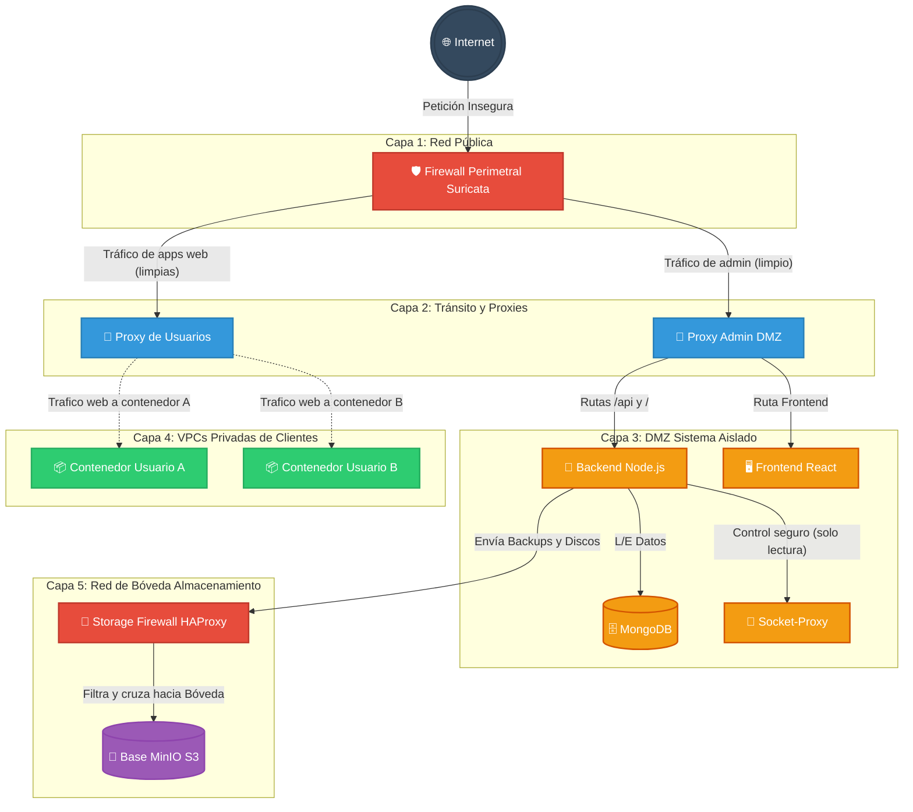
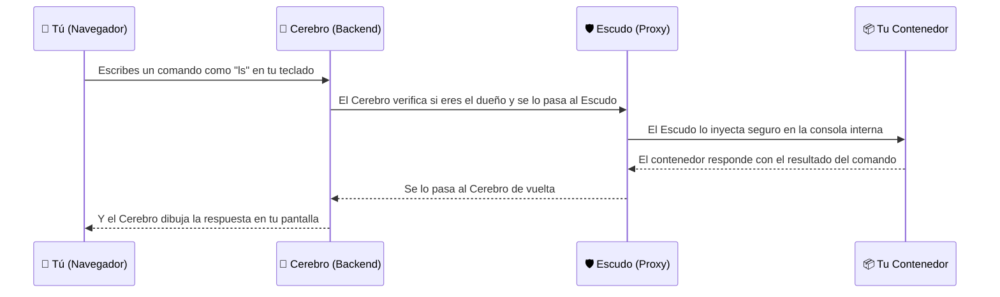

# 🐳 DockerManager: Plataforma CaaS/PaaS con Aislamiento VPC

DockerManager es una solución integral de "Contenedores como Servicio" (CaaS) diseñada para entornos multi-tenant. Permite a usuarios y organizaciones aprovisionar, gestionar y exponer aplicaciones Docker de forma segura, bajo un modelo de **Defensa en Profundidad** que combina aislamiento de red de Capa 2, inspección de tráfico perimetral y políticas comerciales automatizadas.

---

## 🚀 Guía Rápida de Inicio

DockerManager - OrbitCloud corre en producción de forma continua en **[https://orbitcloud.app](https://orbitcloud.app)**. Cada `git push` a `main` desencadena el pipeline CI/CD que reconstruye y redespliega el stack automáticamente.

### 🔗 Servicios en Producción (orbitcloud.app)

| Servicio | Enlace | Credenciales |
|---|---|---|
| **Plataforma Web (Frontend)** | [https://orbitcloud.app](https://orbitcloud.app) | Regístrate directamente |
| **Panel de Monitorización (Grafana)** | [https://grafana.orbitcloud.app](https://grafana.orbitcloud.app) | `GF_SECURITY_ADMIN_PASSWORD` en `.env` del servidor |
| **Métricas (Prometheus)** | [https://prometheus.orbitcloud.app](https://prometheus.orbitcloud.app) | 🔐 BasicAuth (generado con `generate-secrets.sh`) |
| **Eventos Suricata (Grafana → Loki)** | [https://grafana.orbitcloud.app](https://grafana.orbitcloud.app) → Explore → datasource Loki | Mismas credenciales de Grafana |
| **Bóveda MinIO** | Sin URL pública ✅ | Solo accesible via HAProxy interno o SSH tunnel |

> [!TIP]
> Para acceder a la consola de MinIO en producción sin exponerla públicamente: `ssh -L 9001:dockermanager-minio:9001 root@167.99.252.155`


---
## 🔧 Entornos: `docker-compose.yml` vs `docker-compose.override.yml`

El proyecto usa **dos ficheros Compose**. Docker los fusiona automáticamente al ejecutar `docker compose up` en local:

```
docker-compose.yml          ← Definición base (producción, gestionada por CI/CD)
docker-compose.override.yml ← Sobreescritura solo para desarrollo local
```

En **producción**, el pipeline de GitHub Actions ejecuta siempre:
```bash
docker compose -f docker-compose.yml up -d --build
```
...ignorando explícitamente el override. Nunca se usa el override en el servidor.

| | `docker-compose.yml` (Producción) | `docker-compose.override.yml` (Local) |
|---|---|---|
| **Puertos 80/443** | Suricata (IPS gateway real) | Traefik directamente (iptables no funciona en Docker Desktop) |
| **Backend** | Imagen compilada, optimizada | `npm run dev` + hot-reload |
| **Frontend** | Nginx sirviendo el build | Vite dev server con HMR |
| **MinIO** | Solo `storage_net`, sin URL pública | Puerto `9001` expuesto al host |
| **Credenciales** | Variables de `.env` (secrets fuertes) | Variables de `.env` local (valores de prueba) |
| **Auth (Prometheus)** | BasicAuth Traefik activo | Sin autenticación |
| **Logs Suricata** | Promtail → Loki → Grafana | Volume compartido (desarrollo, sin ingestión) |

> [!NOTE]
> El override nunca debe subirse al servidor de producción. El CI/CD lo ignora automáticamente especificando `-f docker-compose.yml`.


---

### 🖥️ Diferencias entre Desarrollo Local y Producción

Esta tabla explica exactamente qué cambia entre ambos entornos. En local, algunas capas de seguridad se simplifican para que el desarrollo sea fluido. En producción, toda la arquitectura funciona al 100% con hardening completo.

| Capa | Desarrollo Local | Producción |
|---|---|---|
| **Firewall Suricata (80/443)** | Bypaseado — Traefik escucha directamente en el host (iptables no funciona en Docker Desktop Windows/Mac) | ✅ Suricata es el único punto de entrada. Todo el tráfico pasa por el IPS antes de llegar a Traefik |
| **SSL / HTTPS** | HTTP plano (`http://localhost`) | ✅ Let's Encrypt automático. Traefik solicita y renueva certificados TLS válidos para todos los subdominios |
| **Credenciales** | Pueden usarse valores de prueba en `.env` local | ✅ Secrets fuertes generados con `generate-secrets.sh`. `.env` en el servidor, nunca en git |
| **MinIO** | Accesible en `localhost:9001` (override.yml expone el puerto) | ✅ Sin URL pública. Solo accesible internamente vía HAProxy o SSH tunnel |
| **Prometheus / EveBox** | Sin autenticación | ✅ BasicAuth Traefik middleware |
| **cAdvisor / node-exporter** | En `dmz_net` (accesibles desde cualquier contenedor) | ✅ En `monitoring_net` aislada. Solo Prometheus puede alcanzarlos |
| **Despliegue** | `docker compose up -d` manual | ✅ CI/CD automático vía GitHub Actions en cada `git push` a `main` |
| **Imágenes** | Build local con hot-reload (bind mounts del código fuente) | ✅ Imágenes compiladas y optimizadas en el VPS. Sin código fuente expuesto |

> [!WARNING]
> Las reglas iptables de Suricata requieren **Linux nativo** (VPS, bare-metal). En Docker Desktop sobre Windows o Mac, el hypervisor intermedio impide que el DNAT del contenedor afecte al routing del host. En local, Traefik sigue teniendo los puertos directos para no bloquear el desarrollo.


---

## 🌍 Despliegue en Producción (CI/CD y Dominio)

El proyecto ha sido diseñado para pasar de desarrollo local a un servidor público real de forma completamente transparente. Actualmente, DockerManager - OrbitCloud se encuentra en producción operando bajo las siguientes infraestructuras:

1. **Alojamiento en VPS:** Todo el stack está desplegado en un servidor VPS remoto de DigitalOcean (Ubuntu), donde las imágenes de los contenedores se compilan nativamente para el entorno de producción.
2. **Dominio Personalizado y SSL:** El dominio principal (`orbitcloud.app`) gestionado en Name.com apunta mediante registros DNS (A) a la IP del VPS. Traefik intercepta de forma inminente este tráfico y genera **Certificados SSL (HTTPS)** totalmente válidos mediante Let's Encrypt (TLS-ALPN-01) otorgando el candado de seguridad obligatorio para dominios `.app`.
3. **Frontend Relativo (Sin Localhost):** El antiguo código rígido del frontend que forzaba peticiones a `localhost` se ha refactorizado entero. Ahora se nutre de **rutas relativas** (proxy interno en desarrollo local y mapeo directo en el servidor VPS), permitiendo funcionar en cualquier dominio subyacente sin colisionar puertos.

### 🤖 Canalización CI/CD (Despliegue Continuo con GitHub Actions)

DockerManager implementa un flujo de DevOps automatizado para olvidarse de acceder manualmente al servidor. En la carpeta `.github/workflows/deploy.yml` reside la magia:

- Cada vez que se hace un `git push` a la rama `main`, un runner esclavo temporal de **GitHub Actions** despierta.
- Inicia una conexión **SSH encriptada** hacia la IP del VPS utilizando los secretos almacenados de forma indescifrable (`VPS_HOST`, `VPS_USERNAME`, `VPS_PASSWORD`).
- Inyecta un `GITHUB_TOKEN` local automáticamente en el servidor para evitar que el VPS bloquee permisos de autenticación de repositorios al intentar hacer `git pull`.
- Utiliza la última tecnología del plugin **Docker Compose V2** (`docker compose up -d --build`) para derribar, reconstruir y reiniciar elegantemente los contenedores modificados **sin downtime manual**. 

Con esto, el panel de control se mantiene siempre fresco y actualizado con el simple hecho de programar y hacer PUSH a GitHub desde la comodidad de casa.

---
## 🏗️ Arquitectura de Red: El Modelo VPC (Virtual Private Cloud)

A diferencia de las soluciones estándar, DockerManager no utiliza una red compartida. Implementa un sistema de **VPC dinámico** donde cada usuario opera en una burbuja de red totalmente privada e invisible para el resto de los inquilinos.

### 🛡️ Segmentación por Capas (Diagarama de las 7 Subredes)

En lugar de poner a todos los usuarios en la misma red (como hacen sistemas simples), la infraestructura funciona como el plano de un edificio blindado. Se orchesta mediante un despliegue de **7 redes separadas por muros virtuales** para garantizar que, si surge un problema o un ataque en una capa, no salte a la siguiente:



| Capa / Red | Descripción para humanos |
|---|---|
| `public_net` | La calle. Único lugar donde se recibe directamente tráfico de internet antes de pasar por nuestro Firewall Guardia. |
| `transit_proxy_inverso` & `transit_proxy_forward` | Los pasillos limpios. Por aquí solo circula tráfico que el Firewall ya ha comprobado que no tiene virus o ataques. |
| `dmz_net` | **Zona Desmilitarizada.** La sala de mandos. Aquí vive la base de datos y la inteligencia del proyecto. Inaccesible para los clientes. |
| `${userId}_default_vlan` (VPC del Usuario) | **Tu burbuja privada.** Redes auto-generadas a las que le hemos cortado el cable a Internet. Aíslan a un usuario por completo. |
| `storage_transit_net` & `storage_net` | **Caja fuerte.** Una bóveda ultra-segura para los discos y backups, protegida por su propio mini-firewall para que nadie pueda conectarse por error. |


### 🧩 Referencia de los "Enanos de Seguridad" (Contenedores de Infraestructura)

Para que tus aplicaciones corran de manera profesional y aislada, a tu alrededor trabajan en secreto **11 contenedores de infraestructura** fijos. Piensa en ellos como la plantilla de trabajadores de un hotel de lujo:

---

#### 1. 🛡️ `dockermanager-edge-fw` — El Guardia de la Puerta (Firewall/Suricata)
Es el único contenedor que da la cara a internet. Todos los ataques de hackers o virus rebotan aquí primero. Inmediatamente analiza el tráfico sospechoso y deja pasar a los clientes legítimos hacia los servicios internos. Imagínalo como el gorila de la discoteca.

#### 2. 🎩 `dockermanager-proxy` — El Conserje para VIPs (Proxy de Administración)
Solo se encarga de recibir a los administradores y usuarios de la plataforma que quieren gestionar sus cosas. Te da acceso a la Interfaz Web y a la API. Ignora por completo las aplicaciones publicadas por ti u otros usuarios.

#### 3. 🚦 `dockermanager-lan-proxy` — El Conserje de los Inquilinos (Proxy de Usuario)
Cuando tú publicas una aplicación con un dominio (ej: `miapp.com`), este contenedor es el que recibe el tráfico limpio que le ha mandado el Guardia, y mágicamente averigua en qué "habitación" (tu red privada VPC) está tu contenedor para enviarle la visita. Ningún tráfico entra a tu aplicación sin pasar antes por él.

#### 4. 🦺 `dockermanager-socket-proxy` — El Escudo de la Sala de Máquinas
El Cerebro del sistema no tiene permitido tocar los cables de las máquinas reales directamente, porque sería peligroso si un robot se vuelve loco. Así que le pide las cosas al Socket Proxy, quien permite ciertas órdenes ("Apaga este contenedor", "Crea una red") y bloquea operaciones destructivas del sistema madre ("Borra todos los discos").

#### 5. 🧠 `dockermanager-backend` — El Cerebro de la Plataforma (Node.js)
El "jefe" del hotel. Crea facturas, maneja los registros, ejecuta los despliegues de tus apps en paralelo, vigila la IA local, manda la creación de redes aisladas e, internamente, programa cosas robóticas automáticas (como apagar tu contenedor si te has pasado del tiempo gratuito).

#### 6. 🖥️ `dockermanager-frontend` — El Mostrador (React)
La interfaz web bonita que tú vas a usar desde tu ordenador. 

#### 7. 🗄️ `dockermanager-mongo` — El Archivero General (Base de Datos)
El libro de registros del hotel en formato MongoDB. Guarda los nombres de usuario, contraseñas cifradas, cuotas disponibles y la lista de todos los contenedores creados. Nunca interactúa con el mundo exterior.

#### 8. 🚧 `dockermanager-storage-fw` — El Puente Elevadizo (Firewall de Almacenamiento)
Para que nadie pueda robar los discos duros ni por accidente desde dentro del sistema, el Cerebro del hotel (Backend) tiene que enviar los documentos o backups a través de este control aduanero interno llamado HAProxy, que solo acepta solicitudes del Backend. Y este lo cruzará hacia la caja fuerte.

#### 9. 🏦 `dockermanager-minio` — La Caja Fuerte (MinIO S3)
Los discos duros reales. Un servidor de almacenamiento privado e interno tipo S3. A esta caja fuerte van ordenados tus discos de persistencia, snapshots de tus contenedores y las copias de seguridad cada 24 horas. Imposible el acceso público directo.
|
| **Imagen** | `traefik:v2.10` |
| **Redes** | `transit_proxy_forward` + `lan_net` + VPCs de usuarios (dinámico) |
| **Constraint label** | `traefik.constraint-label=lan-proxy` |

Proxy dedicado para el tráfico de los contenedores de clientes. Se conecta **dinámicamente** a la red VPC de un usuario solo cuando éste expone un dominio personalizado. Es el **único puente de entrada** permitido a las VPCs privadas — ningún tráfico externo puede llegar a un contenedor de usuario sin pasar por aquí.

---

#### 4. `dockermanager-socket-proxy` — Escudo del Daemon Docker
| | |
|---|---|
| **Imagen** | `tecnativa/docker-socket-proxy` |
| **Redes** | `dmz_net` |
| **Socket** | `/var/run/docker.sock` (solo lectura) |

El Backend **nunca** accede al socket de Docker directamente. Este proxy actúa como intermediario TCP que permite solo las operaciones explícitamente autorizadas (`CONTAINERS`, `IMAGES`, `NETWORKS`, `VOLUMES`, `EXEC`). Impide que un posible compromiso del backend escale privilegios al host.

---

#### 5. `dockermanager-backend` — API y Cerebro del Sistema (Node.js)
| | |
|---|---|
| **Imagen** | `dockermanager/backend:local` |
| **Redes** | `dmz_net` + `storage_transit_net` |
| **Puerto interno** | `5000` |

El núcleo de la plataforma. Gestiona autenticación, cuotas, despliegues, VPCs de usuario, y todos los servicios internos. Arranca tres servicios en segundo plano al iniciarse: el Reaper Service, el Backup Scheduler y el servicio de IA Ollama.

---

#### 6. `dockermanager-frontend` — Interfaz Web (React + Vite)
| | |
|---|---|
| **Imagen** | `dockermanager/frontend:local` |
| **Redes** | `dmz_net` |
| **Puerto interno** | `80` |

SPA construida en React. Se sirve desde Nginx dentro del contenedor. El proxy de admin la expone bajo la ruta `/`. Toda la comunicación con el backend se hace a través de la API en `/api`.

---

#### 7. `dockermanager-mongo` — Base de Datos Principal (MongoDB)
| | |
|---|---|
| **Imagen** | `mongo:latest` |
| **Redes** | `dmz_net` (inaccesible desde el exterior) |
| **Volumen** | `mongo-data:/data/db` |

Almacena todos los datos de la plataforma: usuarios, contenedores registrados, secretos cifrados, redes, audit logs, etc. Solo es accesible desde el backend dentro de la DMZ. Sus datos persisten en el volumen `mongo-data` y se respaldan automáticamente a MinIO cada 24h a través del Storage Firewall.

---

#### 8. `dockermanager-storage-fw` — Firewall de Almacenamiento (HAProxy)
| | |
|---|---|
| **Imagen** | `haproxy:alpine` |
| **Redes** | `storage_transit_net` + `storage_net` |
| **Config** | `./config/haproxy.cfg` |

Puente de Capa 4 que separa físicamente el Backend del almacenamiento. El backend envía peticiones a `storage-fw:9000` (MinIO API), y este proxy las cruza hacia la red `storage_net` verificando que el origen sea legítimo. MinIO es **completamente invisible** desde la DMZ sin pasar por este firewall.

---

#### 9. `dockermanager-minio` — Almacenamiento Unificado (MinIO S3)
| | |
|---|---|
| **Imagen** | `minio/minio:latest` |
| **Redes** | `storage_net` (aislada) |
| **Volumen** | `minio-data:/data` |
| **Consola** | Puerto `9001` (solo accesible internamente) |

Sistema de almacenamiento centralizado e interno. Utilizado para almacenar de manera segura snapshots de contenedores de usuarios y de forma automatizada los **backups unificados del sistema (Base de Datos, Backend y Frontend)**. El backend interactúa con él a través del `storage-fw` usando el protocolo S3, garantizando un aislamiento total de los datos persistentes y bloqueando el acceso público directo.

---

#### 10. 📥 `dockermanager-prometheus` — El Recolector de Telemetría (Prometheus)
| | |
|---|---|
| **Imagen** | `prom/prometheus:latest` |
| **Redes** | `dmz_net` + `monitoring_net` |
| **Volumen** | `prometheus-data:/prometheus` |

Se encarga de conectarse cada 15 segundos a los demás contenedores y al servidor para raspar ("scrape") sus métricas (RAM, CPU, Disco). Actúa como la base de datos temporal hiper-optimizada que guarda todo este histórico de rendimiento.

---

#### 11. 📈 `dockermanager-grafana` — El Panel de Control Visual (Grafana)
| | |
|---|---|
| **Imagen** | `grafana/grafana:latest` |
| **Redes** | `monitoring_net` |
| **Volumen** | `grafana-data:/var/lib/grafana` |
| **URL Producción** | `https://grafana.orbitcloud.app` |

La herramienta visual definitiva. Se conecta a **Prometheus** (métricas de rendimiento) y a **Loki** (eventos de seguridad de Suricata) para ofrecer un panel de control unificado: rendimiento + seguridad en el mismo lugar.

---

#### 12. 🪵 `dockermanager-loki` — El Almacén de Logs (Loki)
| | |
|---|---|
| **Imagen** | `grafana/loki:2.9.0` |
| **Redes** | `monitoring_net` |
| **Volumen** | `loki-data:/loki` |
| **Config** | `./infrastructure/loki/loki.yaml` |

Base de datos de logs optimizada de Grafana. Recibe los eventos de Suricata procesados por Promtail y los almacena eficientemente para que Grafana pueda consultarlos con LogQL. Es la alternativa robusta a EveBox, integrada directamente en el stack de observabilidad.

---

#### 13. 📨 `dockermanager-promtail` — El Lector de Logs (Promtail)
| | |
|---|---|
| **Imagen** | `grafana/promtail:2.9.0` |
| **Redes** | `monitoring_net` |
| **Volumen** | `suricata-logs:/var/log/suricata:ro` |
| **Config** | `./infrastructure/promtail/promtail.yaml` |

Agente de recolección de logs. Lee en tiempo real el archivo `eve.json` generado por Suricata y lo envía a Loki añadiendo etiquetas (`event_type`, `proto`) para poder filtrar fácilmente alertas, flows y eventos TLS desde Grafana.

---

#### 12. 🖥️ `dockermanager-node-exporter` — El Termómetro del Servidor (Node Exporter)
| | |
|---|---|
| **Imagen** | `prom/node-exporter:latest` |
| **Redes** | `dmz_net` |
| **Modo PID** | `host` |

Es un agente ciego que se ancla al sistema de archivos real del servidor de Producción para leer las constantes vitales del hardware subyacente (Carga de CPU nativa, Inodos y espacio libre en disco, red física) y exponerlas en bruto para que Prometheus las recoja.

---

#### 13. 📦 `dockermanager-cadvisor` — El Espía de Contenedores (Google cAdvisor)
| | |
|---|---|
| **Imagen** | `gcr.io/cadvisor/cadvisor:v0.47.0` |
| **Redes** | `dmz_net` |
| **Privilegios** | `privileged: true` |

A diferencia de Node Exporter que mira el hierro, cAdvisor intercepta el kernel de Linux (`/dev/kmsg` y `cgroups`) para espiar a todos y cada uno de los contenedores de los clientes y registrar su consumo individual de Red, RAM y CPU sin entrometerse en sus datos.

---


## ⚙️ Inteligencia del Backend (Cerebro Operativo)

El backend en Node.js no solo gestiona Docker, sino que aplica la lógica de negocio y seguridad:

### 1. Gestión de Cuotas y Recursos (RBAC)
Verifica en tiempo real que el despliegue no exceda los límites de RAM y CPU asignados al plan del usuario (`User.planType`).

### 2. Reaper Service ("El Segador")
Un servicio de tres fases que se ejecuta cada **5 minutos** en segundo plano:

**Fase 1 — Expiración de Planes:**
Busca en MongoDB usuarios con `planExpiresAt` vencido y detiene todos sus contenedores activos. Genera un registro en el Audit Log por cada acción.

**Fase 2 — Límite de Uptime Gratuito (Política Heroku):**
Para usuarios del plan `free`, inspecciona el campo `State.StartedAt` de Docker en tiempo real. Si un contenedor lleva más de **24 horas ininterrumpidas** en ejecución, el Reaper lo detiene automáticamente para liberar recursos del host.

**Fase 3 — Limpieza de Redes VPC Huérfanas:**
Cada ciclo, el Reaper barre todas las redes con la etiqueta `dockermanager.vpc=true` de cada usuario. Si una red ya no tiene contenedores de usuario conectados, la elimina, desconectando previamente el `lan-proxy` si estaba adjunto. Sin este mecanismo, operaciones repetidas de deploy/delete generarían miles de redes `_vlan` y `_open` acumuladas en memoria del kernel del host.

### 3. Zero-Downtime Blue/Green Deployments
Al actualizar una aplicación, el sistema mantiene la versión antigua activa hasta que el nuevo contenedor pasa los healthchecks. El cambio de tráfico en el Proxy es instantáneo y transparente.

### 4. Secret Manager (Cifrado AES-256)
Las variables de entorno sensibles nunca se guardan en texto plano. Se cifran en la base de datos y solo se inyectan en el contenedor en el momento exacto del arranque mediante la sintaxis `APP_KEY={{SECRET:NombreDelSecreto}}`.

---

## 📡 API y Control en Tiempo Real

La comunicación se segmenta en módulos de Express especializados:

| Endpoint | Descripción |
|---|---|
| `POST /api/containers` | Despliega un contenedor o stack completo. Aplica cuotas, crea la VPC del usuario, y conecta el LAN Proxy bajo demanda (_Lazy Attachment_). |
| `PUT /api/containers/:id/redeploy` | Lanzamiento Blue/Green sin corte de servicio. |
| `PUT /api/containers/:id/edit` | Modifica configuración en caliente (dominio, red, recursos). |
| `GET /api/admin/system-containers` | Vista exclusiva para admins de toda la infraestructura (Firewalls, Proxies, DB). |
| `GET /api/audit` | Registros auditables: quién borró qué, qué detuvo el Reaper, etc. |
| `/api/git` & `/api/webhooks` | Pipelines CI/CD. Escucha eventos `push` de GitHub/GitLab para redeploys automáticos. |
| `/api/secrets` | Gestión del Vault de credenciales cifradas. |
| `/api/networks` | Crea VLANs privadas prefijadas por usuario (`${userId}_nombre`), siempre con `Internal: true`. |
| `/api/volumes` | Gestión de discos de persistencia. |
| `POST /api/admin/backup/run` | **[Admin]** Dispara un backup manual inmediato de MongoDB → NAS. |
| `GET /api/admin/backup/list` | **[Admin]** Lista todos los archivos de backup disponibles en el NAS con fecha y tamaño. |

| `/api/snapshots` | Backup de contenedores como archivos `.tar` exportados a MinIO. |
| `/api/ai` | Asistente IA local via Ollama. Los datos nunca salen del servidor. |

---

### Arquitectura del Backup (Zero-Trust S3)

A diferencia de los sistemas tradicionales, DockerManager no utiliza volúmenes compartidos entre el Backend y el Almacenamiento. Todo el tráfico de persistencia es inspeccionado por el firewall.

```
[Red DMZ]                    [Red Storage Transit]          [Red Storage Internal]
────────────────────────     ──────────────────────────     ───────────────────────
[dockermanager-mongo]
        │
        │ 1. Docker Exec API
        ▼
[dockermanager-backend] ───► [dockermanager-storage-fw] ───► [dockermanager-minio]
 (Servicio de Backup)        (Firewall HAProxy:9000)         (S3 API:9000)
                                                                    │
                                                                    │ 2. Persistencia (3 Buckets)
                                                                    ▼
                                                            [Volumen: minio-data]
                                                              (Aislado de la DMZ)
```

**Flujo de Datos:** El backup utiliza el protocolo S3. El chorro de datos viaja desde la base de datos hasta un bucket de MinIO a través del firewall, sin tocar nunca el disco local del Backend.

### Funcionamiento Paso a Paso

1. **Extracción (Triple):** El `backupService.js` realiza tres operaciones simultáneas:
    - **DB:** Ejecuta `mongodump` en el contenedor de MongoDB.
    - **Server:** Realiza un `export` del sistema de archivos del contenedor del Backend.
    - **Web:** Realiza un `export` del sistema de archivos del contenedor del Frontend.
2. **Tránsito:** Envía los datos mediante el SDK de MinIO (S3) al punto de entrada `storage-fw:9000`, pasando por el **Storage Firewall**.
3. **Validación:** El Firewall redirige el tráfico S3 al contenedor interno de MinIO.
4. **Persistencia Aislada:** MinIO guarda los archivos en tres buckets independientes: `backups-mongodb`, `backups-server` y `backups-web`.
5. **Rotación:** El Backend limpia los archivos antiguos en los tres buckets según la política de retención (`BACKUP_RETENTION`).

### Convención de Nombres

```
mongo-db-2026-03-29T10-00-00-000Z.archive.gz
server-snapshot-2026-03-29T10-00-00-000Z.tar
web-snapshot-2026-03-29T10-00-00-000Z.tar
```

Formato: `{componente}-{tipo}-{ISO8601}.{ext}` — ordenables cronológicamente.

### Configuración (Variables de Entorno)

| Variable | Valor por defecto | Descripción |
|---|---|---|
| `MINIO_ENDPOINT` | `storage-fw` | Punto de entrada S3 (a través del firewall) |
| `MINIO_PORT` | `9000` | Puerto del API S3 |
| `MINIO_ROOT_USER` | `admin` | Access Key de MinIO |
| `MINIO_ROOT_PASSWORD` | — | Secret Key de MinIO (definir en `.env`) |
| `BACKUP_INTERVAL_MS` | `86400000` (24h) | Intervalo entre backups automáticos |
| `BACKUP_RETENTION` | `7` | Número de copias a conservar |

### Cómo Restaurar un Backup

La restauración se realiza descargando el archivo desde la consola de MinIO (puerto 9001) e inyectándolo:

```bash
# 1. El administrador descarga el archivo desde el bucket 'backups-mongodb'
# 2. Restaurar usando mongorestore desde el host:
cat mongo-backup-XXX.archive.gz | docker exec -i dockermanager-mongo mongorestore --archive --gzip --drop
```

> [!IMPORTANT]
> El aislamiento de red garantiza que, incluso si el Backend es comprometido, el atacante no tiene acceso físico a los volúmenes de almacenamiento, solo a un endpoint S3 filtrado por el Firewall.

### Endpoints de Administración

| Endpoint | Método | Descripción |
|---|---|---|
| `/api/admin/backup/run` | `POST` | Fuerza un backup inmediato (útil antes de actualizaciones) |
| `/api/admin/backup/list` | `GET` | Lista los backups de los 3 buckets (`mongodb`, `server`, `web`) con bucket, tamaño y fecha |
| `/api/admin/backup/:bucket/:filename` | `DELETE` | Elimina un archivo específico de un bucket de MinIO |

---

## 💻 La Terminal Interactiva (xterm.js) — Explicación sencilla

Cuando haces clic en el botón de la terminal en la plataforma, no te estás conectando de manera directa e insegura a la máquina de linux. Estamos usando **xterm.js**, que es como una "ventana mágica de cine" en el propio navegador web. Todo lo que ves es una "película en directo" del contenedor, enviada letra por letra a tu pantalla de manera segura.

Para que esto sea ultra-seguro y ningún atacante pueda interceptar tus sistemas, la comunicación da varios **saltos** invisibles y ultrarrápidos:



> **¿Qué ganamos con esto?** Que tú tienes control interactivo total de tus contenedores de forma instantánea usando tan solo un navegador web, **sin arriesgarte y sin necesidad de abrir vulnerables puertos SSH o firewalls hacia el exterior.**

---


## ✅ Garantías de Seguridad del Sistema

| Garantía | Descripción |
|---|---|
| **Aislamiento de Capa 2** | Ningún usuario puede ver el tráfico de otro. Docker actúa como un muro físico entre VPCs. |
| **Prevención de Escaneo** | El firewall Suricata bloquea intentos de descubrimiento de red interna (NMAP, etc.). |
| **Inmutabilidad de Red** | Las VPCs son `--internal` por defecto. El acceso a internet es un privilegio concedido y filtrado, no un derecho automático. |
| **Confinamiento del Daemon** | El Socket Proxy impide que el backend (o un contenedor comprometido) escale privilegios al host. |
| **Cifrado en Tránsito y Reposo** | Secretos cifrados con AES-256. Conexiones HTTPS gestionadas por Traefik + Let's Encrypt. |

### 👯‍♂️ Sistema de "Redes Gemelas" — Explicación para humanos

Docker tiene una limitación técnica por defecto: **una red interna aislada no se puede abrir hacia internet mágicamente con un clic**. Si quisieras abrirla manualmente, tendrías que destruirla y crearla de nuevo desde cero, lo que "apagaría" la conexión de todos tus otros contenedores conectados a ella de manera temporal.

Para resolver esto y lograr esa inmediatez en el panel (*un clic y estás publicado*), DockerManager emplea un concepto interno llamado **patrón de redes gemelas**. 

Imagínate que cada red virtual de Docker es una **habitación sin ventanas** 100% segura para tus inquilinos (es tu red privada `Internal`). Y si de repente decides que un contenedor concreto necesita poder interactuar con fuera (darle Internet)... ¿Qué hace el sistema sin que te enteres? En lugar de derruir la habitación completa con todos dentro, el sistema **te construye inmediatamente una habitación gemela idéntica al lado, pero con ventanas (la extensión `_open`)**, y arranca a ese contenedor ahí conectado. Si le quitas internet en la interfaz web, borra la habitación abierta y te lo vuelve a clonar en la segura. 

**Esquema de Flujo visual del sistema:**

```mermaid
flowchart TD
    A[¿Activas el check de Conexión Externa en tu
Contenedor Web / Stack?]
    
    A -->|NO O PULSAS QUITAR INTERNET| B[Modo Seguro / Bloqueado]
    A -->|SÍ, QUIERO INTERNET Y UN DOMINIO| C[Modo Expuesto al Exterior]
    
    B --> B1{¿Dónde lo estás desplegando?}
    B1 -->|VPC por defecto| D[Se manda a la Red: usuario_default_vlan
🔒 100% Privada y Aislada
Imposible hackearte remotamente]
    B1 -->|Red custom personalizada| E[Se manda a la Red: usuario_mi-red
🔒 100% Privada y Aislada]
    
    C --> C1{¿Dónde lo estás desplegando?}
    C1 -->|VPC por defecto| F[Se manda a la Red: usuario_default_vlan (version abierta)
🌐 Conectada a internet con reglas proxy
Se actualizan las defensas Suricata en caliente para él]
    C1 -->|Red custom personalizada| G[El sistema auto-crea la Red: usuario_mi-red_open
🌐 Red Gemela Orientada a Internet
Tus demás procesos y proyectos o DBs que compartían la red
original quedan aislados a salvo]
```

**¿Qué pasa con todas esas habitaciones vacías después?**
No tienes que preocuparte del desorden informático. Si dejas de utilizar aplicaciones expuestas a internet, esa red `_open` abandonada que creamos es detectada por el proceso limpiador que ronda tu cuenta **(El Segador/Reaper)** y la **elimina automáticamente por completo** pasados cinco minutos para ahorrar ancho de banda.


---
|---|---|
| VPC por defecto, Internet **OFF** | `${userId}_default_vlan` | ❌ Bloqueado |
| VPC por defecto, Internet **ON** | `${userId}_default_vlan` recreada | ✅ Filtrado |
| Red custom, Internet **OFF** | `${userId}_mi-red` | ❌ Bloqueado |
| Red custom, Internet **ON** | `${userId}_mi-red_open` (auto-creada) | ✅ Filtrado |
| Sin red (`none`) | — | ❌ Completamente aislado |
| Stack multi-contenedor | `${userId}_stack_xxx_net` | ❌ Bloqueado (por diseño) |

---

## ⚖️ Modelo de Responsabilidad Compartida

DockerManager sigue el mismo modelo de responsabilidad que los grandes proveedores cloud (AWS, Azure, GCP): **la plataforma garantiza la seguridad _de_ la infraestructura; el usuario es responsable de la seguridad _dentro_ de sus aplicaciones.**

| Capa | Responsable | Ejemplos |
|---|---|---|
| **Red perimetral e IDS/IPS** | DockerManager ✅ | Firewall Suricata, bloqueo de escaneos, aislamiento VPC |
| **Aislamiento entre usuarios** | DockerManager ✅ | Redes `Internal`, prefijado de redes, Socket Proxy |
| **Actualizaciones del host** | DockerManager ✅ | Kernel, Docker Engine, Traefik, MongoDB |
| **Imagen del contenedor** | **Usuario** ⚠️ | Usar imágenes base actualizadas, evitar versiones con CVEs conocidos |
| **Seguridad de la aplicación** | **Usuario** ⚠️ | WordPress, plugins, contraseñas, autenticación de la app |
| **Datos dentro del contenedor** | **Usuario** ⚠️ | Backups, cifrado de datos en reposo dentro del volumen |
| **Acceso a Internet activado** | **Usuario** ⚠️ | El usuario acepta la responsabilidad del tráfico saliente al habilitarlo |

> [!NOTE]
> DockerManager protege el **perímetro y la infraestructura**. La seguridad de lo que se ejecuta dentro de cada contenedor — versiones de software, configuraciones, contraseñas de aplicación — es responsabilidad exclusiva del usuario que lo despliega, tal y como ocurre en servicios como Heroku, Render o Railway.

---

## 🔄 Lifecycle Management & Billing Retention

DockerManager incorpora estrategias avanzadas de Billing y Retención propias de plataformas SaaS (Software as a Service):

### 1. Sistema de "Auto-Renew" y Degradación Elegante (Graceful Downgrade)
El esquema de usuario nativo cuenta con un control de pago mensual (campo `autoRenew`).
1. **Renovación Autónoma**: El "Segador" (Reaper Service) comprueba recurrentemente si el plan ha expirado. Si el `autoRenew` está activo (`true`), en vez de apagar los servicios, prolonga automáticamente la vida de la suscripción un mes más para no interrumpir entornos de producción.
2. **Degradación Elegante (Downgrade)**: Si un usuario cancela su plan (`autoRenew = false`), el Reaper tampoco apaga sus máquinas de golpe si tiene aplicaciones publicadas vitales. Cuando su periodo facturado termina, la plataforma rebaja la cuenta automáticamente al plan `free` base, lo cual limitará los recursos RAM/CPU que ese usuario puede gastar, forzándole a adaptar su infraestructura a los límites gratuitos sin desconectarlo fatalmente de un tirón.

### 2. Flujo de Fricción en Cancelaciones (Retargeting)
El panel de **Subscription Management** incluye un túnel de cancelación compuesto por 4 pasos puramente psicológicos y técnicos diseñados para desalentar al máximo el abandono o los clicks accidentales:
- **Paso 1 (Disuasión visual)**: Lista dramática y visual de todo lo que van a perder si abandonan la suscripción premium.
- **Paso 2 (Encuesta estricta)**: Obliga al usuario a interactuar seleccionando un motivo de abandono ("Muy caro", "Faltan features", etc.).
- **Paso 3 (Retención de Última Oportunidad)**: Mensaje empático apelando al Roadmap de plataforma con el botón de cancelar oculto visualmente versus un botón gigante de "I'll Stay".
- **Paso 4 (Sentencia de Culpabilidad y Castigo)**: Se fuerza al usuario a mecanografiar a mano exactamente "I AGREE TO CANCEL". Los eventos de navegador de *copy-paste (Pegar)* están totalmente boicoteados de forma nativa vía JavaScript saltando un "Toast" de notificación castigándolo. Como último paso de frustración controlada, exige aguantar un **countdown de 5 segundos** impidiendo confirmar la operación hasta que finalice por completo.

---

## 🎨 Arquitectura UI Tonal Dinámica (CSS Variables y CSS-in-JS Variables)

DockerManager implementa un sistema unificado y cohesivo de Identidad Visual a lo largo de toda su SPA de React apoyándose de variables nativas de CSS integradas en `tailwind.config.js`.

El diseño emplea una paleta modular nombrada `brand` que inyecta los tonos desde `--brand-50` hasta `--brand-900`. 
Por defecto, toda la plataforma hace uso de una ardiente y vibrante paleta en tonos rojos que responde instantáneamente sin depender de configuraciones estáticas engorrosas en frameworks de Tailwind. 
Tanto el estado local (Light mode/Oscura) se nutren del mismo archivo raíz unificado (`index.css`), suprimiendo completamente los anticuados azules base para uniformizar un "modo espacial agresivo y Premium", con todos los componentes principales (botones, badges y tarjetas de precios) adaptados para leer del alias genérico genérico `bg-brand-500` en vez de usar valores de colores crudos del navegador.

---

## 👁️ Vigilancia de Red Suricata → Loki → Grafana

DockerManager utiliza un pipeline de observabilidad de seguridad basado en el stack de Grafana. Los eventos de red capturados por Suricata (alertas, flows TLS, estadísticas) se visualizan directamente en **Grafana** a través de **Loki** como datasource de logs.

```
dockermanager-edge-fw (Suricata)
        │ escribe eve.json
        ▼
   suricata-logs (Docker Volume)
        │ lee en tiempo real
        ▼
dockermanager-promtail (Promtail)
        │ envía con etiquetas
        ▼
dockermanager-loki (Loki:3100)
        │ almacena y sirve
        ▼
  grafana.orbitcloud.app → Explore → Loki
```

### 🔍 Consultas LogQL útiles en Grafana

Desde **Grafana → Explore → datasource: Loki**:

```logql
# Todos los eventos de Suricata
{job="suricata"}

# Solo alertas de seguridad
{job="suricata", event_type="alert"}

# Solo eventos TLS
{job="suricata", event_type="tls"}

# Filtrar por IP origen
{job="suricata"} | json | src_ip="185.15.54.12"

# Alertas de severidad alta
{job="suricata", event_type="alert"} | json | alert_severity="1"
```

### 🚀 Arranque con Reglas Automáticas

El script de arranque del firewall (`config/edge-fw.sh`) ejecuta automáticamente `suricata-update` al iniciarse, descargando el **ET Open Ruleset (~49.500 reglas)** antes de arrancar el motor. Las reglas se persisten en el volumen `suricata-rules` para no tener que descargarlas en cada reinicio.

> [!NOTE]
> El primer arranque tarda 2-3 minutos extra mientras descarga las reglas de internet. Los reinicios posteriores son instantáneos al usar el caché del volumen.

### ⚠️ Limitación en Docker Desktop (Windows/Mac)

> [!WARNING]
> En Docker Desktop sobre Windows o Mac, Suricata no captura tráfico inter-contenedor porque el switch virtual del hypervisor no replica paquetes. El `eve.json` tendrá muy poco contenido en local. **En producción sobre Linux nativo**, Suricata captura el tráfico completo y Loki lo recibirá automáticamente.

### 🧪 Cómo Verificar el Pipeline

```bash
# Verificar que eve.json tiene datos recientes
docker exec dockermanager-edge-fw tail -3 /var/log/suricata/eve.json

# Verificar que Promtail está enviando a Loki
docker logs dockermanager-promtail --tail 20

# Verificar que Loki recibe datos
docker logs dockermanager-loki --tail 10
```

### 🔧 Añadir Loki como datasource en Grafana

1. **Connections → Data Sources → Add new data source**
2. Selecciona **Loki**
3. URL: `http://dockermanager-loki:3100`
4. **Save & Test** → ✅

Ya puedes usar Explore con las queries LogQL de arriba.

---

## 📊 Observabilidad y Monitorización (Grafana + Prometheus)

Para asegurar la estabilidad en producción, DockerManager incluye un stack completo de métricas integrado directamente en el `docker-compose.yml`. A diferencia de EveBox que vigila intrusiones (Seguridad/IPS), este stack vigila la **salud del rendimiento** del servidor y los contenedores aportando telemetría en tiempo real.

**Accesos y Puertos:**
- **Grafana (Dashboard Visual)**: `http://localhost:3000` (Usuario: `admin` / Contraseña: `admin`)
- **Prometheus (Motor de Series Temporales)**: *Oculto en la red DMZ (No expuesto directamente al público por seguridad).*

### Los 4 Pilares de la Monitorización

1. 📥 **Prometheus (El Recolector):** Es el corazón del sistema. Cada 15 segundos se dedica a preguntar automáticamente al resto de los componentes cómo se encuentran, y guarda todo el histórico de métricas de forma súper eficiente en una base de datos propia (`prometheus-data`).

2. 📈 **Grafana (El Visualizador):** Prometheus por sí solo solo guarda números puros. Grafana se conecta a Prometheus y te permite crear paneles de control (Dashboards) preciosos y fáciles de entender con gráficos sobre consumo de RAM, alertas por correo si se cae un servidor, etc.

3. 🖥️ **Node Exporter (Métricas del Host/Hardware):** Un pequeño "chivato" o agente instalado mediante un contenedor. Informa a Prometheus exclusivamente sobre el estado de la **máquina real (El servidor Ubuntu/Debian host)**:
   - ¿Queda espacio libre en el disco duro físico?
    Escudo->>TuContenedor: El Escudo lo inyecta seguro en la consola interna
    TuContenedor-->>Escudo: El contenedor responde con el resultado del comando
    Escudo-->>Cerebro: Se lo pasa al Cerebro de vuelta
    Cerebro-->>TuNavegador: Y el Cerebro dibuja la respuesta en tu pantalla
```

> **¿Qué ganamos con esto?** Que tú tienes control interactivo total de tus contenedores de forma instantánea usando tan solo un navegador web, **sin arriesgarte y sin necesidad de abrir vulnerables puertos SSH o firewalls hacia el exterior.**

---


## ✅ Garantías de Seguridad del Sistema

| Garantía | Descripción |
|---|---|
| **Aislamiento de Capa 2** | Ningún usuario puede ver el tráfico de otro. Docker actúa como un muro físico entre VPCs. |
| **Prevención de Escaneo** | El firewall Suricata bloquea intentos de descubrimiento de red interna (NMAP, etc.). |
| **Inmutabilidad de Red** | Las VPCs son `--internal` por defecto. El acceso a internet es un privilegio concedido y filtrado, no un derecho automático. |
| **Confinamiento del Daemon** | El Socket Proxy impide que el backend (o un contenedor comprometido) escale privilegios al host. |
| **Cifrado en Tránsito y Reposo** | Secretos cifrados con AES-256. Conexiones HTTPS gestionadas por Traefik + Let's Encrypt. |

### 👯‍♂️ Sistema de "Redes Gemelas" — Explicación para humanos

Docker tiene una limitación técnica por defecto: **una red interna aislada no se puede abrir hacia internet mágicamente con un clic**. Si quisieras abrirla manualmente, tendrías que destruirla y crearla de nuevo desde cero, lo que "apagaría" la conexión de todos tus otros contenedores conectados a ella de manera temporal.

Para resolver esto y lograr esa inmediatez en el panel (*un clic y estás publicado*), DockerManager emplea un concepto interno llamado **patrón de redes gemelas**. 

Imagínate que cada red virtual de Docker es una **habitación sin ventanas** 100% segura para tus inquilinos (es tu red privada `Internal`). Y si de repente decides que un contenedor concreto necesita poder interactuar con fuera (darle Internet)... ¿Qué hace el sistema sin que te enteres? En lugar de derruir la habitación completa con todos dentro, el sistema **te construye inmediatamente una habitación gemela idéntica al lado, pero con ventanas (la extensión `_open`)**, y arranca a ese contenedor ahí conectado. Si le quitas internet en la interfaz web, borra la habitación abierta y te lo vuelve a clonar en la segura. 

**Esquema de Flujo visual del sistema:**

```mermaid
flowchart TD
    A[¿Activas el check de Conexión Externa en tu
Contenedor Web / Stack?]
    
    A -->|NO O PULSAS QUITAR INTERNET| B[Modo Seguro / Bloqueado]
    A -->|SÍ, QUIERO INTERNET Y UN DOMINIO| C[Modo Expuesto al Exterior]
    
    B --> B1{¿Dónde lo estás desplegando?}
    B1 -->|VPC por defecto| D[Se manda a la Red: usuario_default_vlan
🔒 100% Privada y Aislada
Imposible hackearte remotamente]
    B1 -->|Red custom personalizada| E[Se manda a la Red: usuario_mi-red
🔒 100% Privada y Aislada]
    
    C --> C1{¿Dónde lo estás desplegando?}
    C1 -->|VPC por defecto| F[Se manda a la Red: usuario_default_vlan (version abierta)
🌐 Conectada a internet con reglas proxy
Se actualizan las defensas Suricata en caliente para él]
    C1 -->|Red custom personalizada| G[El sistema auto-crea la Red: usuario_mi-red_open
🌐 Red Gemela Orientada a Internet
Tus demás procesos y proyectos o DBs que compartían la red
original quedan aislados a salvo]
```

**¿Qué pasa con todas esas habitaciones vacías después?**
No tienes que preocuparte del desorden informático. Si dejas de utilizar aplicaciones expuestas a internet, esa red `_open` abandonada que creamos es detectada por el proceso limpiador que ronda tu cuenta **(El Segador/Reaper)** y la **elimina automáticamente por completo** pasados cinco minutos para ahorrar ancho de banda.


---
|---|---|
| VPC por defecto, Internet **OFF** | `${userId}_default_vlan` | ❌ Bloqueado |
| VPC por defecto, Internet **ON** | `${userId}_default_vlan` recreada | ✅ Filtrado |
| Red custom, Internet **OFF** | `${userId}_mi-red` | ❌ Bloqueado |
| Red custom, Internet **ON** | `${userId}_mi-red_open` (auto-creada) | ✅ Filtrado |
| Sin red (`none`) | — | ❌ Completamente aislado |
| Stack multi-contenedor | `${userId}_stack_xxx_net` | ❌ Bloqueado (por diseño) |

---

## ⚖️ Modelo de Responsabilidad Compartida

DockerManager sigue el mismo modelo de responsabilidad que los grandes proveedores cloud (AWS, Azure, GCP): **la plataforma garantiza la seguridad _de_ la infraestructura; el usuario es responsable de la seguridad _dentro_ de sus aplicaciones.**

| Capa | Responsable | Ejemplos |
|---|---|---|
| **Red perimetral e IDS/IPS** | DockerManager ✅ | Firewall Suricata, bloqueo de escaneos, aislamiento VPC |
| **Aislamiento entre usuarios** | DockerManager ✅ | Redes `Internal`, prefijado de redes, Socket Proxy |
| **Actualizaciones del host** | DockerManager ✅ | Kernel, Docker Engine, Traefik, MongoDB |
| **Imagen del contenedor** | **Usuario** ⚠️ | Usar imágenes base actualizadas, evitar versiones con CVEs conocidos |
| **Seguridad de la aplicación** | **Usuario** ⚠️ | WordPress, plugins, contraseñas, autenticación de la app |
| **Datos dentro del contenedor** | **Usuario** ⚠️ | Backups, cifrado de datos en reposo dentro del volumen |
| **Acceso a Internet activado** | **Usuario** ⚠️ | El usuario acepta la responsabilidad del tráfico saliente al habilitarlo |

> [!NOTE]
> DockerManager protege el **perímetro y la infraestructura**. La seguridad de lo que se ejecuta dentro de cada contenedor — versiones de software, configuraciones, contraseñas de aplicación — es responsabilidad exclusiva del usuario que lo despliega, tal y como ocurre en servicios como Heroku, Render o Railway.

---

## 🔄 Lifecycle Management & Billing Retention

DockerManager incorpora estrategias avanzadas de Billing y Retención propias de plataformas SaaS (Software as a Service):

### 1. Sistema de "Auto-Renew" y Degradación Elegante (Graceful Downgrade)
El esquema de usuario nativo cuenta con un control de pago mensual (campo `autoRenew`).
1. **Renovación Autónoma**: El "Segador" (Reaper Service) comprueba recurrentemente si el plan ha expirado. Si el `autoRenew` está activo (`true`), en vez de apagar los servicios, prolonga automáticamente la vida de la suscripción un mes más para no interrumpir entornos de producción.
2. **Degradación Elegante (Downgrade)**: Si un usuario cancela su plan (`autoRenew = false`), el Reaper tampoco apaga sus máquinas de golpe si tiene aplicaciones publicadas vitales. Cuando su periodo facturado termina, la plataforma rebaja la cuenta automáticamente al plan `free` base, lo cual limitará los recursos RAM/CPU que ese usuario puede gastar, forzándole a adaptar su infraestructura a los límites gratuitos sin desconectarlo fatalmente de un tirón.

### 2. Flujo de Fricción en Cancelaciones (Retargeting)
El panel de **Subscription Management** incluye un túnel de cancelación compuesto por 4 pasos puramente psicológicos y técnicos diseñados para desalentar al máximo el abandono o los clicks accidentales:
- **Paso 1 (Disuasión visual)**: Lista dramática y visual de todo lo que van a perder si abandonan la suscripción premium.
- **Paso 2 (Encuesta estricta)**: Obliga al usuario a interactuar seleccionando un motivo de abandono ("Muy caro", "Faltan features", etc.).
- **Paso 3 (Retención de Última Oportunidad)**: Mensaje empático apelando al Roadmap de plataforma con el botón de cancelar oculto visualmente versus un botón gigante de "I'll Stay".
- **Paso 4 (Sentencia de Culpabilidad y Castigo)**: Se fuerza al usuario a mecanografiar a mano exactamente "I AGREE TO CANCEL". Los eventos de navegador de *copy-paste (Pegar)* están totalmente boicoteados de forma nativa vía JavaScript saltando un "Toast" de notificación castigándolo. Como último paso de frustración controlada, exige aguantar un **countdown de 5 segundos** impidiendo confirmar la operación hasta que finalice por completo.

---

## 🎨 Arquitectura UI Tonal Dinámica (CSS Variables y CSS-in-JS Variables)

DockerManager implementa un sistema unificado y cohesivo de Identidad Visual a lo largo de toda su SPA de React apoyándose de variables nativas de CSS integradas en `tailwind.config.js`.

El diseño emplea una paleta modular nombrada `brand` que inyecta los tonos desde `--brand-50` hasta `--brand-900`. 
Por defecto, toda la plataforma hace uso de una ardiente y vibrante paleta en tonos rojos que responde instantáneamente sin depender de configuraciones estáticas engorrosas en frameworks de Tailwind. 
Tanto el estado local (Light mode/Oscura) se nutren del mismo archivo raíz unificado (`index.css`), suprimiendo completamente los anticuados azules base para uniformizar un "modo espacial agresivo y Premium", con todos los componentes principales (botones, badges y tarjetas de precios) adaptados para leer del alias genérico genérico `bg-brand-500` en vez de usar valores de colores crudos del navegador.

---

## 📊 Observabilidad y Monitorización (Grafana + Prometheus + Loki)

DockerManager incluye un stack completo de observabilidad integrado en el `docker-compose.yml`. Desde **[grafana.orbitcloud.app](https://grafana.orbitcloud.app)** el administrador tiene una visión unificada de dos dimensiones:

- 💪 **Rendimiento** — CPU, RAM, disco y red del servidor y de cada contenedor (Prometheus)
- 🔒 **Seguridad** — Eventos de red capturados por Suricata en tiempo real (Loki)

### Los 5 Pilares de la Monitorización

1. 📥 **Prometheus** — Cada 15s scrape de métricas al servidor y contenedores. Base de datos de series temporales en `prometheus-data`.
2. 📈 **Grafana** — Panel visual en `https://grafana.orbitcloud.app`. Se conecta a Prometheus y Loki.
3. 🖥️ **Node Exporter** — Métricas del servidor físico: CPU, RAM, disco, red, uptime.
4. 📦 **cAdvisor** — Métricas de cada contenedor Docker individualmente.
5. 🪵 **Loki + Promtail** — Promtail lee `eve.json` de Suricata y lo envía a Loki. Grafana consulta con LogQL.

### 🗣️ Dashboards disponibles

| Dashboard | Cómo importarlo | Datasource | Qué muestra |
|---|---|---|---|
| **Node Exporter Full** | Import → ID `1860` | `prometheus` | CPU, RAM, disco, red del servidor físico |
| **Docker Containers** | Import → pegar `infrastructure/grafana/dashboards/cadvisor.json` | `prometheus` | Métricas individuales por contenedor |
| **Suricata IDS/IPS** | Import → pegar `infrastructure/grafana/dashboards/suricata.json` | `loki` | Alertas y eventos de seguridad |

---

### 🖥️ Dashboard: Node Exporter Full (ID 1860)

Monitoriza el **servidor físico** (el VPS/host, no los contenedores).

**Importar:** Dashboards → New → Import → escribe `1860` → Load → datasource `prometheus` → Import

**Paneles:**
- **Quick CPU / Mem / Disk**: gauges del estado actual del servidor
- **CPU Basic**: histórico de uso por tipo (system, user, iowait, idle)
- **Memory Basic**: RAM total / usada / cacheada / libre
- **Disk I/O**: velocidad de lectura y escritura del disco físico
- **Network**: tráfico de red de la interfaz principal
- **Uptime**: tiempo encendido desde el último reinicio

---

### 📦 Dashboard: Docker Containers (cadvisor.json)

Monitoriza **cada contenedor Docker individualmente** con métricas en tiempo real.

**Importar:** Dashboards → New → Import → pegar contenido de `infrastructure/grafana/dashboards/cadvisor.json` → datasource `prometheus` → Import

**Paneles:**
- **Stat cards**: contenedores activos, % CPU total, RAM total usada, tráfico de red
- **CPU por contenedor** (timeseries): evolución del uso de CPU de cada contenedor
- **RAM por contenedor** (timeseries): memoria consumida por cada contenedor en MB/GB
- **Red por contenedor** (timeseries): bytes/s recibidos
- **Top 10 por RAM** (bargauge): ranking de contenedores más voraces en memoria
- **Top 10 por CPU** (bargauge): ranking de contenedores más exigentes en CPU

> [!TIP]
> Usa este dashboard para detectar el **"noisy neighbor"**: el contenedor que consume recursos desproporcionados y degrada el rendimiento del resto de inquilinos.

---

### 🛡️ Dashboard: Suricata IDS/IPS (suricata.json)

Visualiza los **eventos de seguridad de red** capturados por Suricata (~3s de delay).

**Importar:** Dashboards → New → Import → pegar contenido de `infrastructure/grafana/dashboards/suricata.json` → datasource `loki` → Import

**Paneles:**
- **Stat cards**: alertas 24h, eventos totales 6h, conexiones TLS, alertas última hora
- **Alertas formateadas**: `🚨 IP_origen:puerto → IP_destino:puerto | Proto | Sev:N | Firma detectada`
- **Volumen por tipo** (timeseries): alert, tls, flow, http, ssh, stats, anomaly
- **Protocolos** (donut chart): TCP / UDP / IPv6-ICMP
- **Eventos TLS**: `🔒 IP → dominio_sni | TLS 1.3`
- **Stream completo**: todos los eventos con tipo, IPs y protocolo

**Queries LogQL útiles en Explore:**
```logql
{job="suricata", event_type="alert"} | json | alert_severity="1"        # alertas críticas
{job="suricata", event_type="alert"} | json | alert_signature=~".*SCAN.*" # escaneos
{job="suricata"} | json | src_ip="185.15.54.12"                          # IP concreta
```

**Live mode:** En Grafana → Explore → Loki → query `{job="suricata"}` → botón ▶ **Live** para stream en tiempo real.

---

### ⚠️ IDS (detección) vs IPS (prevención)

| Modo | Comportamiento | Config | Riesgo |
|---|---|---|---|
| **IDS** ✅ (actual) | Detecta y registra — el tráfico malicioso **pasa igualmente** | `af-packet` (pasivo) | Ninguno |
| **IPS** 🚧 | Detecta **y bloquea** activamente los paquetes maliciosos | `nfqueue` (inline) | Falsos positivos pueden cortar tráfico legítimo |

En el dashboard verás `action: allowed` en todas las alertas — esto confirma que Suricata está en **modo IDS** (solo observa, no bloquea).

> [!WARNING]
> Activar IPS en producción sin afinar las reglas puede bloquear tráfico legítimo. Se recomienda ejecutar en modo IDS durante al menos 2 semanas, revisar los falsos positivos en el dashboard, y solo entonces activar el bloqueo.

### 🔧 Configurar datasources en Grafana

**Prometheus** (métricas de rendimiento):
1. Connections → Data Sources → Add → **Prometheus**
2. URL: `http://dockermanager-prometheus:9090`
3. Save & Test → ✅

**Loki** (logs de seguridad Suricata):
1. Connections → Data Sources → Add → **Loki**
2. URL: `http://dockermanager-loki:3100`
3. Save & Test → ✅

---

## 🔒 Hardening de Producción

Esta sección documenta todas las mejoras de seguridad aplicadas al `docker-compose.yml` base para cumplir los requisitos de producción. Cada cambio tiene su código de referencia en los comentarios del compose.

### ¿Qué había antes y qué cambió?

| # | Componente | Problema original | Solución aplicada |
|---|---|---|---|
| 1 | **Suricata** (`edge-fw`) | Bypasseado — Traefik tenía los puertos 80/443 directos | Suricata ahora es el único punto de entrada. DNAT vía iptables PREROUTING a Traefik |
| 2 | **MinIO** | Estaba en `dmz_net` → bypass potencial del HAProxy | Eliminado de `dmz_net`. Solo en `storage_net` (red interna). HAProxy es el único gateway |
| 3 | **Backend router** | Entrypoint solo `websecure` → llamadas HTTP al `/api` fallaban | Cambiado a `web,websecure`. La redirección HTTP→HTTPS global gestiona el upgrade |
| 4 | **Prometheus** | Accesible sin autenticación | BasicAuth Traefik middleware vía `${PROMETHEUS_BASICAUTH_USERS}` |
| 5 | **cAdvisor + node-exporter** | En `dmz_net` → accesibles desde cualquier servicio de la DMZ | Movidos a `monitoring_net` (red interna aislada). Solo Prometheus puede alcanzarlos |
| 6 | **Logs Suricata** | EveBox 0.24.x incompatible (server/agent separados sin soporte en single-container) | Reemplazado por **Loki + Promtail**. Promtail lee `eve.json` y alimenta Loki. Grafana visualiza con LogQL |
| 7 | **Credenciales** | Hardcodeadas en el compose (`password123`, `admin`) | Leídas de `.env` vía `${VAR}`. Ninguna credencial en el código fuente |
| 8 | **Admin user seeding** | Script de seed en startup creaba admin con contraseña hardcodeada | Eliminado. El rol `admin` se asigna automáticamente al registrarse con `admin@orbitcloud.app` |

---

### 1. 🔴 Suricata como Gateway Real (iptables PREROUTING)

**Antes** — Traefik tenía los puertos mapeados al host directamente. Suricata estaba adjunto a las redes pero el tráfico real nunca pasaba por él:
```yaml
# ❌ ANTES: Traefik bypasaba Suricata
proxy-inverso:
  ports:
    - "80:80"
    - "443:443"
```

**Después** — Suricata tiene los puertos. El script `config/edge-fw.sh` configura iptables PREROUTING para DNAT todo el tráfico hacia Traefik:
```yaml
# ✅ DESPUÉS: Suricata es el único punto de entrada
edge-fw:
  ports:
    - "80:80"
    - "443:443"
# Traefik ya NO tiene puertos mapeados al host
```

El script de arranque (`config/edge-fw.sh`) ejecuta automáticamente:
```bash
iptables -t nat -A PREROUTING -p tcp --dport 80  -j DNAT --to-destination $PROXY_IP:80
iptables -t nat -A PREROUTING -p tcp --dport 443 -j DNAT --to-destination $PROXY_IP:443
iptables -t nat -A POSTROUTING -p tcp -d $PROXY_IP --dport 80  -j MASQUERADE
iptables -t nat -A POSTROUTING -p tcp -d $PROXY_IP --dport 443 -j MASQUERADE
```

El script incluye un **retry loop de 10 intentos** para esperar a que `proxy-inverso` esté listo, y hace **flush previo** de las reglas para evitar duplicados en reinicios.

> [!WARNING]
> En **Docker Desktop (Windows/Mac)** las reglas iptables del contenedor no afectan al routing del host virtual del hypervisor. Este setup funciona en su totalidad sobre **Linux nativo** (VPS, servidor bare-metal). En local, Traefik sigue accesible directamente para no romper el desarrollo.

---

### 2. 🟡 MinIO aislado en storage_net

**Antes:** MinIO estaba en `dmz_net` además de `storage_net`, lo que rompía el aislamiento declarado en el README (cualquier servicio de la DMZ podía conectarse directamente a MinIO).

**Después:** MinIO solo está en `storage_net` (red `internal: true`). El único gateway es `storage-fw` (HAProxy).

```yaml
minio:
  networks:
    - storage_net  # ✅ Solo storage_net
    # dmz_net eliminado ✅
```

Los **labels de Traefik se han eliminado** de MinIO porque Traefik no puede alcanzar un servicio con el que no comparte red. El acceso a la consola MinIO en producción debe hacerse via:
- Port-forward temporal: `docker exec -it dockermanager-storage-fw ...`
- VPN/bastion al servidor
- SSH tunnel al VPS: `ssh -L 9001:dockermanager-minio:9001 user@servidor`

---

### 3. 🟡 Red de Monitorización Aislada

Se añadió una nueva red `monitoring_net` con `internal: true` para aislar los exporters de métricas:

```yaml
monitoring_net:
  driver: bridge
  internal: true  # Sin acceso a internet, invisible desde dmz_net
```

| Contenedor | Antes | Después |
|---|---|---|
| `cadvisor` | `dmz_net` | `monitoring_net` únicamente |
| `node-exporter` | `dmz_net` | `monitoring_net` únicamente |
| `prometheus` | `dmz_net` | `dmz_net` + `monitoring_net` |

Prometheus necesita ambas redes: `dmz_net` para ser alcanzado por Grafana y Traefik, y `monitoring_net` para poder hacer scrape de cAdvisor y node-exporter.

---

### 4. 🟡 BasicAuth en Prometheus y EveBox

Ambos servicios tienen ahora un middleware de autenticación básica gestionado por Traefik:

```yaml
# Prometheus
- "traefik.http.routers.prometheus.middlewares=prometheus-auth"
- "traefik.http.middlewares.prometheus-auth.basicauth.users=${PROMETHEUS_BASICAUTH_USERS}"

# EveBox
- "traefik.http.routers.evebox.middlewares=evebox-auth"
- "traefik.http.middlewares.evebox-auth.basicauth.users=${EVEBOX_BASICAUTH_USERS}"
```

El valor de `PROMETHEUS_BASICAUTH_USERS` y `EVEBOX_BASICAUTH_USERS` es un hash **htpasswd** con `$` escapados a `$$`. Se genera con el script incluido.

---

### 5. 🔴 Gestión de Credenciales con `.env`

**Antes:** Credenciales hardcodeadas directamente en el `docker-compose.yml`:
```yaml
- MINIO_ROOT_PASSWORD=password123  # ❌
- NAS_PASSWORD=password123         # ❌
- GF_SECURITY_ADMIN_PASSWORD=admin # ❌
```

**Después:** Todas las credenciales se leen de variables de entorno:
```yaml
- MINIO_ROOT_PASSWORD=${MINIO_ROOT_PASSWORD}  # ✅
- NAS_PASSWORD=${NAS_PASSWORD}                # ✅
- GF_SECURITY_ADMIN_PASSWORD=${GF_SECURITY_ADMIN_PASSWORD} # ✅
```

El archivo `.env` está excluido del repositorio via `.gitignore`.

---

### 🚀 Cómo preparar el entorno de producción

```bash
# 1. Generar todos los secrets interactivamente
#    (instala apache2-utils si no tienes htpasswd)
chmod +x generate-secrets.sh
./generate-secrets.sh

# 2. Revisar el .env generado
cat .env

# 3. Desplegar
docker compose -f docker-compose.yml up -d --build

# 4. Verificar que Suricata configuró iptables correctamente
docker logs dockermanager-edge-fw | grep -E "(DNAT|iptables|Warning)"
```

> [!IMPORTANT]
> El archivo `.env` contiene credenciales reales. **Nunca lo subas a git.** El `.gitignore` ya lo excluye, pero verifica con `git status` antes de cada commit.
