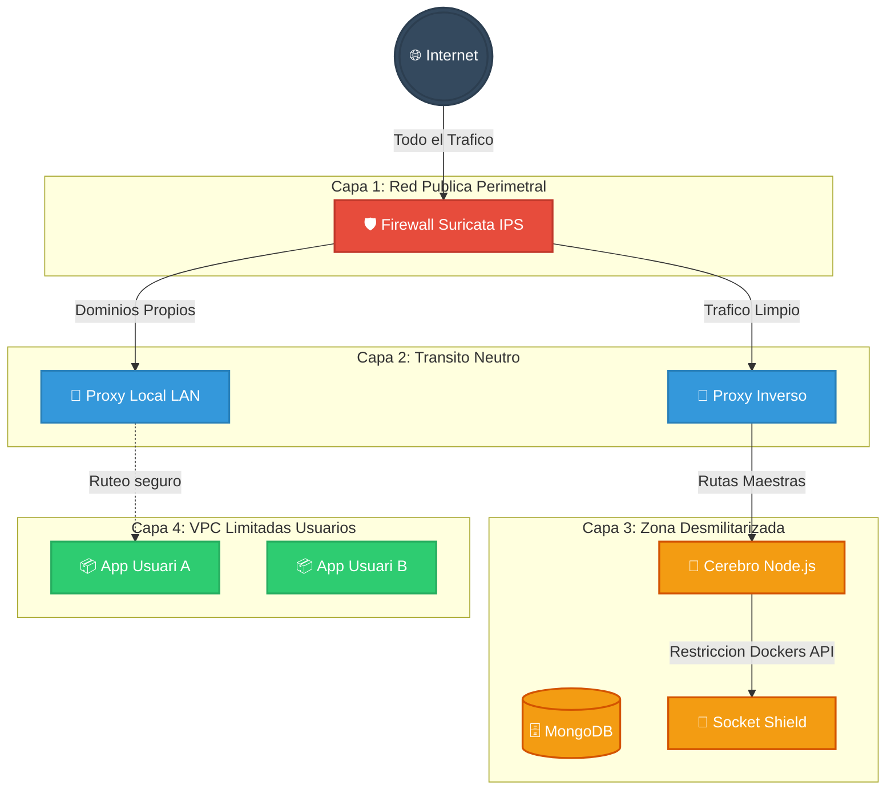

# 🐳 OrbitCloud: Plataforma CaaS/PaaS con Aislamiento VPC

OrbitCloud es una solución integral de "Contenedores como Servicio" (CaaS) diseñada para entornos multi-tenant. Permite a usuarios y organizaciones aprovisionar, gestionar y exponer aplicaciones Docker de forma segura, estructurada bajo un modelo de **Defensa en Profundidad** que combina aislamiento de red VPC (Capa 2), inspección de tráfico perimetral activo (Suricata IPS) y políticas de retención automatizadas.

---

## 🌟 1. Introducción y Acceso a Producción

La infraestructura de OrbitCloud ejecuta en producción integrando de forma continua código mediante acciones de CI/CD para garantizar que el despliegue de las actualizaciones carezca de interrupciones (*zero-downtime*).

| Servicio                                  | Enlace                         | Notas de Acceso |
|-------------------------------------------|--------------------------------|-----------------|
| **Plataforma Web (Frontend)**             | https://orbitcloud.app         | Registro abierto público |
| **Monitorización (Grafana + Loki)**       | https://grafana.orbitcloud.app | Requiere credenciales Admin generadas en `.env` |
| **Bóveda de Backups (MinIO)**             | *Sin acceso público*           | Solo accesible vía SSH Tunnel al puerto 9001 del VPS |

> [!TIP]
> Para acceder a la consola de MinIO en producción sin exponerla públicamente: `ssh -L 9001:orbitcloud-minio:9001 root@167.99.252.155`

---

## 🚀 2. Guía de Despliegue y CI/CD

El proyecto rige un ecosistema dual para dividir de forma inquebrantable el desarrollo local de la ejecución real en el Cloud:

### `docker-compose.yml` vs `docker-compose.override.yml`
- **Producción (`docker-compose.yml`)**: Diseñado para Linux/VPS. El Firewall acapara los puestos 80/443 íntegros e intercepta **todo el tráfico**. Se fuerza a construir del código base sin ataduras al sistema nativo.
- **Local (`docker-compose.override.yml`)**: Preparado para Windows/Mac OS donde `iptables` nativo no surte efecto en el _Virtual Switch_ de Docker. Expone puertos 80/443 de Traefik para desarrollo rápido con Vite HMR y Nodemodules mapeados al disco duro local.

### 🤖 CI/CD (Despliegue Continuo)
Se sitúa en un entorno autogestionado `.github/workflows/deploy.yml`. Cada `git push` a `main`:
1. Se conecta mediante SSH en secreto (Secrets de Github) al VPS en DigitalOcean.
2. Descarga el código actualizado (`git pull`).
3. Ejecuta de un modo ininterrumpido `docker compose -f docker-compose.yml up -d --build`, destruyendo, compilando y recreando sólo aquello reconstruido y manteniendo intactos y seguros los volúmenes de usuarios.

---

## 🏗️ 3. Arquitectura de Red (El Modelo VPC)

A diferencia de un hosting básico, no conviven los contenedores de inquilinos en un mismo hub. Emplea un sistema **VPC dinámico** dividiéndose en un tablero multicapa de seguridad extrema:

### 👯‍♂️ Redes Gemelas (Generación Automática de VPC)
Docker carece de un botón mágico para dar/quitar Internet interno en vivo a contenedores blindados.
El Backend administra al invocar la API la creencia del patrón VPC Gemelo:
- **Red por defecto Segura**: Cada usuario porta un prefijo (Ej: `usuario_default_vlan`) donde todo lo desplegado no alcanza salir jamás al exterior.
- **Red Abierta (`_open`)**: Al solicitar Exposición Web en el panel, el Backend levanta otra gemela temporal inyectando conexión Proxy, despliega tu servicio allí y actualiza tu dominio. Si lo quitas, se borra instantáneamente esta pasarela en modo _Lazy_ sin afectar los demás recursos subyacentes desconectados en la base principal.

---

## 🛡️ 4. Seguridad Profunda e IDS/IPS Suricata

### 🚫 De Detector (IDS) a Bloqueador Nítido (IPS)
Antiguamente los firewalls tradicionales se regían simplemente por escuchar pasivamente el tráfico con interfaces clonadas (`af-packet / PCAP`) alertando sobre intrusiones sin intervenir.
OrbitCloud ahora blinda en Capa 4 a través de Netfilter Queue (NFQUEUE):

1. **La Front-Door:** El Firewall (`edge-fw`) secuestra por completo los puertos del Host (80/443). Ni siquiera el proxy tiene control sobre la placa de red directamente.
2. **Cola de Enrutamiento:** En vez de que `iptables` enrute mediante DNAT el tráfico a ciegas, se implementó una redirección a una cola maestra mediante la bandera `-j NFQUEUE --queue-num 0`.
3. **Decisión por Lotes:** Suricata levanta el motor de prevención IPS (`-q 0`) analizando el contenido binario del TCP. Si una firma cruza base de datos maligna con un veredicto de bloqueo explícito (`DROP`), este desintegra nativamente el TCP sin delegarlo a Traefik. Si es benigno (o carece de firmas malignas), la función aprueba (`ACCEPT`) completando el NAT y abriendo paso hacia las VPC.

### 🛡️ Escudo Daemon (Socket-Proxy)
En sistemas convencionales el API del Orquestador suele montar y acceder libremente a `/var/run/docker.sock` poseyendo permisos infinitos como *Root*. Aquí un contenedor proxy en medio restringe todas las directrices, y si el código madre es vulnerado por un usuario mediante comandos mal intencionados en Node, el `Socket Proxy` rechazará peticiones de "Borrado Masivo", "Escalada de Permisos" y "Privilegios" en `/run/docker.sock`.

---

## ⚙️ 5. Inteligencia del Backend "El Cerebro"

### El Segador (Reaper Service)
Para garantizar la economía del PaaS y controlar el abuso informático existe un Robot perenne operando sin pausas en background en Node.js, cubriendo 3 etapas cada 5 minutos:
1. **Límite Heroku:** Contenedores de planes gratuitos no pueden ejecutarse por 24h seguidas. Pasados 1440 minutos en el _Docker State_, les inyecta señal SIGTERM para forzar ahorro e hibernación.
2. **Destornillador de VPCs:** Las "Habitaciones Gemelas" (_VPC_Open_) que resultan vacías de recursos al deshabilitarse la exposición de Dominios en el panel de UI, quedan estancadas temporalmente. El recolector de basuras limpia agresivamente todas las redes residuales sin servicios levantados.
3. **Rotación Autosuficiente:** Evalúa tarjetas de suscripciones Premium para bajarlos ordenadamente a _Freemium_ de manera natural antes que derribar su ecosistema abruptamente, restringiéndoles paulatinamente RAM según su cambio.

### Terminal Interactiva Segura (xterm.js)
No se abren puertos SSH por cliente ni se abren puertos remotos. Las sesiones de consolas interactúan con XTERM generando una comunicación con WebSocket puenteada a través de Backend hacia el Socket Proxy. El usuario final dispone de un shell encapsulado e irreversible sobre su propio contenedor mediante una ventana renderizada en formato cine sin tocar comandos inseguros hacia afuera.

---

## 💾 6. Almacenamiento Zero-Trust y Backups S3

La persistencia de copias de seguridad de configuración global rige mediante una zona muerta Zero-Trust. El sistema de DB y Archivos jamás está directamente unido al disco o volumen de acceso compartido.
El nodo `backend` empaqueta con `tar/mongodump` 3 elementos críticos: MongoDB, Web-Panel y el Server System. Los inyecta vía protocolo AWS S3 apuntando a una muralla HAProxy en el puerto estricto interno 9000, quien cruza de a un solo sentido el paquete para blindarlo en **MinIO**. Si alguien ataca o formatea la VPC/DMZ, la base interna MinIO carece de retorno salvaguardando las bases de la Plataforma inmutables. 

---

## 📊 7. Observabilidad Integral

Una Plataforma de este tamaño dispone de un panel propio paralelo unificado bajo una base monitorizada temporal de métricas para dominar la visión de todos los frentes posibles:

- **Eje de Redimiento Físico (Prometheus)**:
  - **Node Exporter**: Toma las constantes vitales del servidor VPS de producción (CPU en hardware, RAM en la placa total, Inodos/Disco al bare-metal).
  - **cAdvisor**: Corta y fracciona de manera autónoma las cuotas que gasta individualmente cada contenedor (`[+]` y `[-]`), graficalizando abusos.
- **Eje Ciberseguridad (Stack Loki)**:
  - Todas las tramas, detecciones SSL de firmas y cruces TLS inspeccionadas en el borde (`Suricata`) generan un stream json enorme. Un recolector `Promtail` aspira ese registro por volumen y lo entierra ultra-segmentado en el clúster transaccional temporal `Loki` permitiendo desde Grafana aplicar búsquedas `LogQL` completas con alarmísticas visuales de detecciones perimetrales.

---

## ⚖️ 8. Modelo de Responsabilidad Compartida

| Resonsabilidad / Capa | ¿Quién se hace cargo? | Comportamiento en OrbitCloud |
|-----------------------|-------------------------|--------------------------------|
| **Bloqueo Network DOS/Escaneo** | OrbitCloud ✅ | Suricata IPS dropa tráfico hostil e infiltración masiva en red (NFQUEUE). |
| **Separación de Lógica (Capa 2)** | OrbitCloud ✅ | VPC prefijadas internas prohibidas al resto. Cifrado RSA/AES. |
| **Versión del OS Docker / Engine**| OrbitCloud ✅ | Mantenimiento a cargo de los administradores. CI/CD nativo Traefik/Mongo. |
| **Librerias Interiores/Base Apps**| Usuario ⚠️ | Elegir PHP 5 vulnerable en tu app privada recae en tu irresponsabilidad. |
| **Roles / Autenticación CMS App** | Usuario ⚠️ | Configurar un Wordpress propio `admin/1234` será bajo tus secuelas. |
| **Archivos en Volúmenes App**     | Usuario ⚠️ | Persistir en Minio (S3 Snapshot) requiere que se inicie bajo petición. |

--- 

_Documentación estructurada y consolidada para OrbitCloud SaaS_
