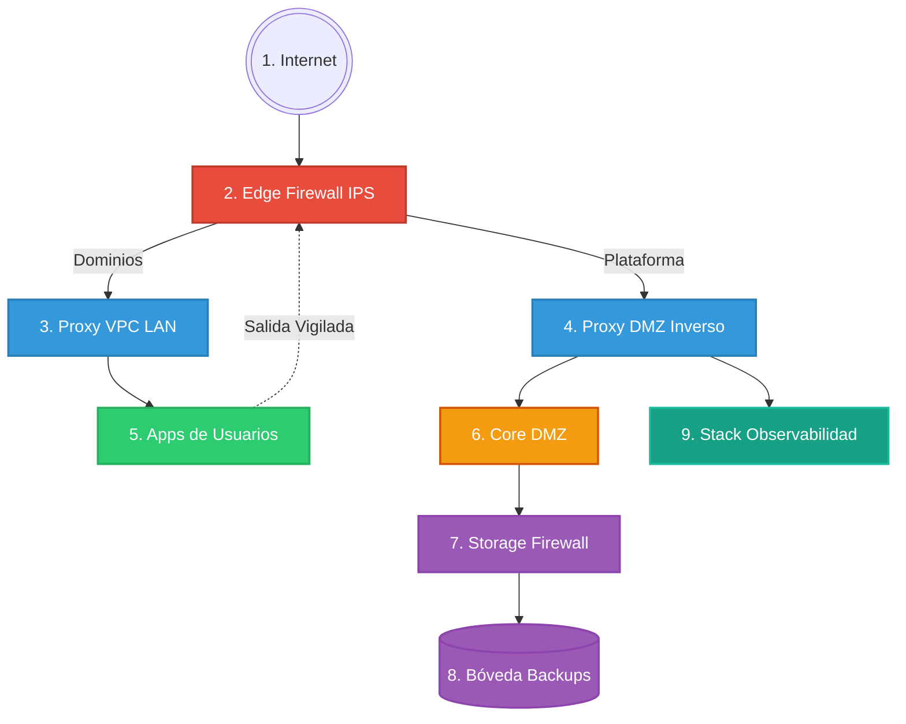

# 🐳 OrbitCloud: Plataforma CaaS/PaaS con Aislamiento VPC

OrbitCloud es una solución integral de "Contenedores como Servicio" (CaaS) diseñada para entornos multi-tenant. Permite a usuarios y organizaciones aprovisionar, gestionar y exponer aplicaciones Docker de forma segura, estructurada bajo un modelo de **Defensa en Profundidad** que combina aislamiento de red VPC (Capa 2), inspección de tráfico perimetral activo (Suricata IPS) y políticas de retención automatizadas.

---

## 🌟 1. Introducción y Acceso a Producción

La infraestructura de OrbitCloud ejecuta en producción integrando de forma continua código mediante acciones de CI/CD para garantizar que el despliegue de las actualizaciones carezca de interrupciones (*zero-downtime*).

| Servicio                                  | Enlace                         | Notas de Acceso |
|-------------------------------------------|--------------------------------|-----------------|
| **Plataforma Web (Frontend)**             | https://orbitcloud.app         | Registro abierto público |
| **Monitorización (Grafana + Loki)**       | https://grafana.orbitcloud.app | Requiere credenciales Admin generadas en `.env` |
| **Bóveda de Backups (MinIO)**             | *Sin acceso público*           | Solo accesible vía SSH Tunnel al puerto 9001 del VPS |

> [!TIP]
> Para acceder a la consola de MinIO en producción sin exponerla públicamente: `ssh -L 9001:orbitcloud-minio:9001 root@167.99.252.155`

---

## 🚀 2. Guía de Despliegue y CI/CD

El proyecto rige un ecosistema dual para dividir de forma inquebrantable el desarrollo local de la ejecución real en el Cloud:

### `docker-compose.yml` vs `docker-compose.override.yml`
- **Producción (`docker-compose.yml`)**: Diseñado para Linux/VPS. El Firewall acapara los puestos 80/443 íntegros e intercepta **todo el tráfico**. Se fuerza a construir del código base sin ataduras al sistema nativo.
- **Local (`docker-compose.override.yml`)**: Preparado para Windows/Mac OS donde `iptables` nativo no surte efecto en el _Virtual Switch_ de Docker. Expone puertos 80/443 de Traefik para desarrollo rápido con Vite HMR y Nodemodules mapeados al disco duro local.

### 🤖 CI/CD (Despliegue Continuo)
Se sitúa en un entorno autogestionado `.github/workflows/deploy.yml`. Cada `git push` a `main`:
1. Se conecta mediante SSH en secreto (Secrets de Github) al VPS en DigitalOcean.
2. Descarga el código actualizado (`git pull`).
3. Ejecuta de un modo ininterrumpido `docker compose -f docker-compose.yml up -d --build`, destruyendo, compilando y recreando sólo aquello reconstruido y manteniendo intactos y seguros los volúmenes de usuarios.

---

## 🏗️ 3. Arquitectura de Red (El Modelo de Defensa en Profundidad)

La infraestructura de OrbitCloud no es un simple alojamiento donde los contenedores conviven desordenadamente. Emplea un modelo estricto de **Defensa en Profundidad (Defense in Depth)**, estructurado en **5 capas herméticas** que garantizan el aislamiento, la inspección de tráfico y la protección de los datos:

1. **Capa 1: Red Pública Perimetral (Firewall IDS/IPS):** Todo el tráfico real de Internet colisiona primero contra **Suricata**. Nada entra al servidor sin que este motor analice las firmas de los paquetes. Si detecta tráfico malicioso, lo bloquea. También inspecciona el tráfico de *salida* de los contenedores para evitar que participen en botnets o ciberataques.
2. **Capa 2: Tránsito Neutro (Enrutadores Proxy):** Una vez Suricata limpia el tráfico, este se bifurca a dos proxies Traefik independientes:
   - **Proxy DMZ Inverso:** Exclusivo para la plataforma administrativa y API.
   - **Proxy VPC LAN:** Exclusivo para enrutar tráfico a las aplicaciones de los clientes.
3. **Capa 3: VPCs Aisladas de Usuarios (Aislamiento L2):** Los contenedores de cada cliente residen en redes puente de Docker independientes. A nivel de kernel de Linux (iptables), redes distintas **no pueden comunicarse entre sí**. El contenedor del Usuario A jamás podrá ver al del Usuario B.
4. **Capa 4: Zona Desmilitarizada (DMZ):** Aquí habitan el Cerebro (Backend), Frontend Vite y MongoDB. Son **invisibles** tanto a Internet como a los propios usuarios. Además, el Backend no ejecuta comandos Docker como Root, sino a través de un **Socket Shield** que bloquea operaciones destructivas.
5. **Capa 5: Zero-Trust Storage (Bóveda MinIO):** Los backups del sistema NO residen en la DMZ, viven en su propia red (`storage_net`). Para que el Backend almacene datos, debe cruzar un **Firewall de Almacenamiento (HAProxy)** que actúa como un túnel unidireccional estricto. Si la DMZ sufriera un hackeo, sería imposible formatear o comprometer la bóveda de backups.

### Esquema del Flujo de Red

### 📖 Leyenda del Esquema Completo
1. **Internet**: Origen y destino global del tráfico.
2. **Edge Firewall IPS** (`dockermanager-edge-fw`): Escudo perimetral físico (Suricata). Intercepta los puertos 80/443 reales e inspecciona tráfico malicioso.
3. **Proxy VPC LAN** (`dockermanager-lan-proxy`): Enrutador Traefik dedicado en exclusiva a redireccionar el tráfico web de los clientes a sus propios contenedores.
4. **Proxy DMZ Inverso** (`dockermanager-proxy`): Enrutador Traefik maestro para dar acceso a los servicios administrativos de la plataforma.
5. **Apps de Usuarios** (Contenedores Dinámicos, ej. `user-app-xyz`): Redes temporales y aisladas (VPCs L2) que contienen los servicios levantados por los clientes.
6. **Core DMZ** (El núcleo central invisible a Internet):
   - `dockermanager-backend`: Cerebro de la API en Node.js.
   - `dockermanager-frontend`: Panel web de clientes (Vite/React).
   - `dockermanager-mongo`: Base de datos de estado global.
   - `dockermanager-ollama`: Motor de Inteligencia Artificial local.
7. **Storage Firewall** (`dockermanager-storage-fw`): Cortafuegos interno HAProxy que ejerce como peaje de un solo sentido (TCP 9000).
8. **Bóveda Backups** (`dockermanager-minio`): Zero-Trust Storage. Caja fuerte S3 desconectada del resto de la plataforma.
9. **Stack Observabilidad** (Telemetría y Monitorización):
   - `dockermanager-grafana`: Panel de visualización de datos.
   - `dockermanager-prometheus`: Motor de extracción de métricas.
   - `dockermanager-loki`: Base de datos transaccional de Logs.
   - `dockermanager-promtail`: Recolector de logs de ataques del firewall.
   - `dockermanager-cadvisor`: Monitorización de CPU/RAM de contenedores.
   - `dockermanager-node-exporter`: Monitorización del hardware del VPS.

### 🔐 Conceptos Clave de Seguridad en el Esquema
*   **La "Salida Vigilada" (Egress Filtering)**: Cuando los contenedores de los clientes intentan conectarse a Internet por su cuenta (por ejemplo, para descargar un virus, hacer peticiones externas o lanzar un ataque DDoS), este tráfico está forzado a salir a través de la red física del anfitrión. El contenedor `dockermanager-edge-fw` intercepta silenciosamente este tráfico saliente usando `NFQUEUE`, inspeccionando los paquetes y cortando de raíz cualquier intento de conexión hacia servidores maliciosos o botnets.
*   **El "Socket Shield" (`dockermanager-socket-proxy`)**: En sistemas normales, el backend de Node.js tiene control absoluto sobre el motor de Docker (acceso *root* al host). Si un hacker encontrara una vulnerabilidad en tu backend, podría destruir todo el servidor físico. Para impedirlo, el backend está obligado a hablar con Docker a través de este proxy intermedio. El `socket-proxy` intercepta las órdenes y solo deja pasar comandos inofensivos (como arrancar o parar los contenedores de los clientes), bloqueando permanentemente comandos letales (como borrar redes maestras, acceder al sistema de archivos del host o escalar privilegios).

### 👯‍♂️ Redes Gemelas (Generación Automática de VPC)
Docker carece de un botón mágico para dar/quitar Internet interno en vivo a contenedores blindados.
El Backend administra al invocar la API la creencia del patrón VPC Gemelo:
- **Red por defecto Segura**: Cada usuario porta un prefijo (Ej: `usuario_default_vlan`) donde todo lo desplegado no alcanza salir jamás al exterior de forma directa sin pasar por el IPS.
- **Red Abierta (`_open`)**: Al solicitar Exposición Web en el panel, el Backend levanta otra gemela temporal inyectando conexión al `Proxy VPC LAN`, despliega tu servicio allí y actualiza tu dominio. Si lo quitas, se borra instantáneamente esta pasarela en modo _Lazy_ sin afectar los demás recursos subyacentes desconectados en la base principal.

---

## 🛡️ 4. Seguridad Profunda e IDS/IPS Suricata

### 🚫 De Detector (IDS) a Bloqueador Nítido (IPS)
Antiguamente los firewalls tradicionales se regían simplemente por escuchar pasivamente el tráfico con interfaces clonadas (`af-packet / PCAP`) alertando sobre intrusiones sin intervenir.
OrbitCloud ahora blinda en Capa 4 a través de Netfilter Queue (NFQUEUE):

1. **La Front-Door:** El Firewall (`edge-fw`) secuestra por completo los puertos del Host (80/443). Ni siquiera el proxy tiene control sobre la placa de red directamente.
2. **Enrutamiento y Reglas IPTables:** Todo se gestiona mediante reglas estrictas de iptables que aseguran que ningún tráfico escape la verificación.
   - **DNAT y MASQUERADE:** Todo el tráfico entrante a los puertos web (80/443) es capturado y redireccionado forzosamente (`PREROUTING -j DNAT`) hacia el Proxy Interno (Traefik). Se aplica `MASQUERADE` al retornar a fin de garantizar el flujo bidireccional correcto.
   - **Cola de Prevención IPS:** En vez de que las reglas de reenvío pasen a ciegas, se aplica un embudo maestro a través de las reglas:
     `iptables -I FORWARD -p tcp --dport 80 -j NFQUEUE --queue-num 0 --queue-bypass` (y análogas para el puerto 443).
     Esto evita romper conexiones internas (como los WebSockets locales de Docker o puertos de administración internos), auditando **únicamente** la navegación web expuesta.
3. **Decisión por Lotes (Veredictos):** Suricata levanta el motor de prevención IPS (`-q 0`) interceptando el canal del NFQUEUE. Aquí, en lugar de realizar cálculos de Checksum (`checksum-validation: no` desactivado para evitar choques con el offloading de las redes virtuales inter-Docker), el motor cruza los paquetes TCP contra las Firmas Malignas. Si se detecta un intruso con firma `DROP`, Suricata envía la orden de abortar la conexión; en caso contrario, devuelve `ACCEPT` e iptables continúa la ruta habitual hasta el VPC.

### 🛡️ Escudo Daemon (Socket-Proxy)
En sistemas convencionales el API del Orquestador suele montar y acceder libremente a `/var/run/docker.sock` poseyendo permisos infinitos como *Root*. Aquí un contenedor proxy en medio restringe todas las directrices, y si el código madre es vulnerado por un usuario mediante comandos mal intencionados en Node, el `Socket Proxy` rechazará peticiones de "Borrado Masivo", "Escalada de Permisos" y "Privilegios" en `/run/docker.sock`.

*Actualización de permisos (Storage)*: Para calcular con precisión las cuotas de disco consumido (`docker system df`), el Socket Proxy tiene habilitado específicamente el comando de consulta de disco (`SYSTEM=1`), pero preserva bloqueados los accesos inseguros de control maestro.

---

## ⚙️ 5. Inteligencia del Backend "El Cerebro"

### El Segador (Reaper Service)
Para garantizar la economía del PaaS y controlar el abuso informático existe un Robot perenne operando sin pausas en background en Node.js, cubriendo 3 etapas cada 5 minutos:
1. **Límite Heroku:** Contenedores de planes gratuitos no pueden ejecutarse por 24h seguidas. Pasados 1440 minutos en el _Docker State_, les inyecta señal SIGTERM para forzar ahorro e hibernación.
2. **Destornillador de VPCs:** Las "Habitaciones Gemelas" (_VPC_Open_) que resultan vacías de recursos al deshabilitarse la exposición de Dominios en el panel de UI, quedan estancadas temporalmente. El recolector de basuras limpia agresivamente todas las redes residuales sin servicios levantados.
3. **Rotación Autosuficiente:** Evalúa tarjetas de suscripciones Premium para bajarlos ordenadamente a _Freemium_ de manera natural antes que derribar su ecosistema abruptamente, restringiéndoles paulatinamente RAM según su cambio.

### Terminal Interactiva Segura (xterm.js)
No se abren puertos SSH por cliente ni se abren puertos remotos. Las sesiones de consolas interactúan con XTERM generando una comunicación con WebSocket puenteada a través de Backend hacia el Socket Proxy. El usuario final dispone de un shell encapsulado e irreversible sobre su propio contenedor mediante una ventana renderizada en formato cine sin tocar comandos inseguros hacia afuera.

*Resolución de Rutas y Websockets (Traefik)*: El tráfico para la consola terminal viaja por la ruta paralela `/socket.io/` gestionada íntegramente por Traefik, que evalúa explícitamente tanto el tráfico del API como el de los WebSockets (`PathPrefix('/api') || PathPrefix('/socket.io')`). Además, para evitar colisiones y timeouts (Error 504) causados por la pertenencia del Backend a múltiples redes simultáneas, se ha implementado la asignación estricta de red en Traefik (`traefik.docker.network=dmz_net`), garantizando el enrutamiento directo y exclusivo por la DMZ.

---

## 💾 6. Almacenamiento Zero-Trust y Backups S3

La persistencia de copias de seguridad de configuración global rige mediante una zona muerta Zero-Trust. El sistema de DB y Archivos jamás está directamente unido al disco o volumen de acceso compartido.
El nodo `backend` empaqueta con `tar/mongodump` 3 elementos críticos: MongoDB, Web-Panel y el Server System. Los inyecta vía protocolo AWS S3 apuntando a una muralla HAProxy en el puerto estricto interno 9000, quien cruza de a un solo sentido el paquete para blindarlo en **MinIO**. Si alguien ataca o formatea la VPC/DMZ, la base interna MinIO carece de retorno salvaguardando las bases de la Plataforma inmutables. 

---

## 📊 7. Observabilidad Integral

Una Plataforma de este tamaño dispone de un panel propio paralelo unificado bajo una base monitorizada temporal de métricas para dominar la visión de todos los frentes posibles:

- **Eje de Redimiento Físico (Prometheus)**:
  - **Node Exporter**: Toma las constantes vitales del servidor VPS de producción (CPU en hardware, RAM en la placa total, Inodos/Disco al bare-metal).
  - **cAdvisor**: Corta y fracciona de manera autónoma las cuotas que gasta individualmente cada contenedor (`[+]` y `[-]`), graficalizando abusos.
- **Eje Ciberseguridad (Stack Loki)**:
  - Todas las tramas, detecciones SSL de firmas y cruces TLS inspeccionadas en el borde (`Suricata`) generan un stream json enorme. Un recolector `Promtail` aspira ese registro por volumen y lo entierra ultra-segmentado en el clúster transaccional temporal `Loki` permitiendo desde Grafana aplicar búsquedas `LogQL` completas con alarmísticas visuales de detecciones perimetrales.

---

## ⚖️ 8. Modelo de Responsabilidad Compartida

| Resonsabilidad / Capa | ¿Quién se hace cargo? | Comportamiento en OrbitCloud |
|-----------------------|-------------------------|--------------------------------|
| **Bloqueo Network DOS/Escaneo** | OrbitCloud ✅ | Suricata IPS dropa tráfico hostil e infiltración masiva en red (NFQUEUE). |
| **Separación de Lógica (Capa 2)** | OrbitCloud ✅ | VPC prefijadas internas prohibidas al resto. Cifrado RSA/AES. |
| **Versión del OS Docker / Engine**| OrbitCloud ✅ | Mantenimiento a cargo de los administradores. CI/CD nativo Traefik/Mongo. |
| **Librerias Interiores/Base Apps**| Usuario ⚠️ | Elegir PHP 5 vulnerable en tu app privada recae en tu irresponsabilidad. |
| **Roles / Autenticación CMS App** | Usuario ⚠️ | Configurar un Wordpress propio `admin/1234` será bajo tus secuelas. |
| **Archivos en Volúmenes App**     | Usuario ⚠️ | Persistir en Minio (S3 Snapshot) requiere que se inicie bajo petición. |

--- 

_Documentación estructurada y consolidada para OrbitCloud SaaS_
