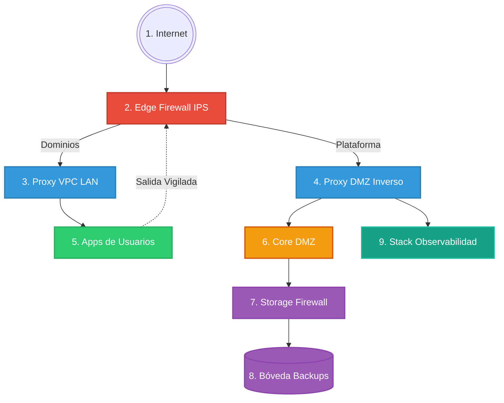

# 🐳 OrbitCloud: Plataforma CaaS/PaaS con Aislamiento VPC

OrbitCloud es una solución integral de "Contenedores como Servicio" (CaaS) diseñada para entornos multi-tenant. Permite a usuarios y organizaciones aprovisionar, gestionar y exponer aplicaciones Docker de forma segura, estructurada bajo un modelo de **Defensa en Profundidad** que combina aislamiento de red VPC (Capa 2), inspección de tráfico perimetral activo (Suricata IPS) y políticas de retención automatizadas.

---

## 🌟 1. Introducción y Acceso a Producción

La infraestructura de OrbitCloud ejecuta en producción integrando de forma continua código mediante acciones de CI/CD para garantizar que el despliegue de las actualizaciones carezca de interrupciones (*zero-downtime*).

| Servicio                                  | Enlace                         | Notas de Acceso |
|-------------------------------------------|--------------------------------|-----------------|
| **Plataforma Web (Frontend)**             | https://orbitcloud.app         | Registro abierto público |
| **Monitorización (Grafana + Loki)**       | https://grafana.orbitcloud.app | |
| **Bóveda de Backups (MinIO)**             | *Sin acceso público*           | Solo accesible vía SSH Tunnel al puerto 9001 del VPS |

> [!TIP]
> Para acceder a la consola de MinIO en producción sin exponerla públicamente: `ssh -L 9001:orbitcloud-minio:9001 root@167.99.252.155`

---

## 🚀 2. Guía de Despliegue y CI/CD

El proyecto rige un ecosistema dual para dividir de forma inquebrantable el desarrollo local de la ejecución real en el Cloud:

### `docker-compose.yml` vs `docker-compose.dev.yml`
- **Producción (`docker-compose.yml`)**: Diseñado para Linux/VPS. El Firewall acapara los puestos 80/443 íntegros e intercepta **todo el tráfico**. `docker compose up` debe usar **solo** este archivo en el servidor (sin override automático) para no sustituir el frontend por Vite por error.
- **Local (`docker-compose.dev.yml`)**: Desarrollo con hot-reload. Ejemplo: `docker compose -f docker-compose.yml -f docker-compose.dev.yml up --build`. Expone MinIO en el host y usa Vite/Nodemon donde aplica.

### 🤖 CI/CD (Despliegue Continuo)
Se sitúa en un entorno autogestionado `.github/workflows/deploy.yml`. Cada `git push` a `main`:
1. Se conecta mediante SSH en secreto (Secrets de Github) al VPS en DigitalOcean.
2. Descarga el código actualizado (`git pull`).
3. Ejecuta de un modo ininterrumpido `docker compose -f docker-compose.yml up -d --build`, destruyendo, compilando y recreando sólo aquello reconstruido y manteniendo intactos y seguros los volúmenes de usuarios.

---

## 🏗️ 3. Arquitectura de Red (El Modelo de Defensa en Profundidad)

La infraestructura de OrbitCloud no es un simple alojamiento donde los contenedores conviven desordenadamente. Emplea un modelo estricto de **Defensa en Profundidad (Defense in Depth)**, estructurado en **5 capas herméticas** que garantizan el aislamiento, la inspección de tráfico y la protección de los datos:

1. **Capa 1: Red Pública Perimetral (Firewall IDS/IPS):** Todo el tráfico real de Internet colisiona primero contra **Suricata**. Nada entra al servidor sin que este motor analice las firmas de los paquetes. Si detecta tráfico malicioso, lo bloquea. También inspecciona el tráfico de *salida* de los contenedores para evitar que participen en botnets o ciberataques.
2. **Capa 2: Tránsito Neutro (Enrutadores Proxy):** Una vez Suricata limpia el tráfico, este se bifurca a dos proxies Traefik independientes:
   - **Proxy DMZ Inverso:** Exclusivo para la plataforma administrativa y API.
   - **Proxy VPC LAN:** Exclusivo para enrutar tráfico a las aplicaciones de los clientes.
3. **Capa 3: VPCs Aisladas de Usuarios (Aislamiento L2):** Los contenedores de cada cliente residen en redes puente de Docker independientes. A nivel de kernel de Linux (iptables), redes distintas **no pueden comunicarse entre sí**. El contenedor del Usuario A jamás podrá ver al del Usuario B.
4. **Capa 4: Zona Desmilitarizada (DMZ):** Aquí habitan el Cerebro (Backend), Frontend Vite y MongoDB. Son **invisibles** tanto a Internet como a los propios usuarios. Además, el Backend no ejecuta comandos Docker como Root, sino a través de un **Socket Shield** que bloquea operaciones destructivas.
5. **Capa 5: Zero-Trust Storage (Bóveda MinIO):** Los backups del sistema NO residen en la DMZ, viven en su propia red (`storage_net`). Para que el Backend almacene datos, debe cruzar un **Firewall de Almacenamiento (HAProxy)** que actúa como un túnel unidireccional estricto. Si la DMZ sufriera un hackeo, sería imposible formatear o comprometer la bóveda de backups.

### Esquema del Flujo de Red



### 📖 Leyenda del Esquema Completo
1. **Internet**: Origen y destino global del tráfico.
2. **Edge Firewall IPS** (`dockermanager-edge-fw`): Escudo perimetral físico (Suricata). Intercepta los puertos 80/443 reales e inspecciona tráfico malicioso.
3. **Proxy VPC LAN** (`dockermanager-lan-proxy`): Enrutador Traefik dedicado en exclusiva a redireccionar el tráfico web de los clientes a sus propios contenedores.
4. **Proxy DMZ Inverso** (`dockermanager-proxy`): Enrutador Traefik maestro para dar acceso a los servicios administrativos de la plataforma.
5. **Apps de Usuarios** (Contenedores Dinámicos, ej. `user-app-xyz`): Redes temporales y aisladas (VPCs L2) que contienen los servicios levantados por los clientes.
6. **Core DMZ** (El núcleo central invisible a Internet):
   - `dockermanager-backend`: Cerebro de la API en Node.js.
   - `dockermanager-frontend`: Panel web de clientes (Vite/React).
   - `dockermanager-mongo`: Base de datos de estado global.
   - `dockermanager-ollama`: Motor de Inteligencia Artificial local.
7. **Storage Firewall** (`dockermanager-storage-fw`): Cortafuegos interno HAProxy que ejerce como peaje de un solo sentido (TCP 9000).
8. **Bóveda Backups** (`dockermanager-minio`): Zero-Trust Storage. Caja fuerte S3 desconectada del resto de la plataforma.
9. **Stack Observabilidad** (Telemetría y Monitorización):
   - `dockermanager-grafana`: Panel de visualización de datos.
   - `dockermanager-prometheus`: Motor de extracción de métricas.
   - `dockermanager-loki`: Base de datos transaccional de Logs.
   - `dockermanager-promtail`: Recolector de logs de ataques del firewall.
   - `dockermanager-cadvisor`: Monitorización de CPU/RAM de contenedores.
   - `dockermanager-node-exporter`: Monitorización del hardware del VPS.

### 🔐 Conceptos Clave de Seguridad en el Esquema
*   **La "Salida Vigilada" (Egress Filtering)**: Cuando los contenedores de los clientes intentan conectarse a Internet por su cuenta (por ejemplo, para descargar un virus, hacer peticiones externas o lanzar un ataque DDoS), este tráfico está forzado a salir a través de la red física del anfitrión. El contenedor `dockermanager-edge-fw` intercepta silenciosamente este tráfico saliente usando `NFQUEUE`, inspeccionando los paquetes y cortando de raíz cualquier intento de conexión hacia servidores maliciosos o botnets.
*   **El "Socket Shield" (`dockermanager-socket-proxy`)**: En sistemas normales, el backend de Node.js tiene control absoluto sobre el motor de Docker (acceso *root* al host). Si un hacker encontrara una vulnerabilidad en tu backend, podría destruir todo el servidor físico. Para impedirlo, el backend está obligado a hablar con Docker a través de este proxy intermedio. El `socket-proxy` intercepta las órdenes y solo deja pasar comandos inofensivos (como arrancar o parar los contenedores de los clientes), bloqueando permanentemente comandos letales (como borrar redes maestras, acceder al sistema de archivos del host o escalar privilegios).
*   **La Consola Segura (Terminal Web)**: Es importante entender que el enrutador `Proxy VPC LAN` sirve **únicamente** para que los visitantes externos vean la web que un cliente ha alojado (ej. `app.usuario.com`). Cuando el dueño de la app quiere abrir la terminal de comandos desde el panel de OrbitCloud, el flujo es completamente distinto: la conexión WebSocket viaja por la ruta de la plataforma (`Proxy DMZ Inverso`) hacia el `Backend`. Es el Backend quien, a través del `Socket Shield`, inyecta la sesión de terminal (`docker exec`) de forma 100% segura. **Nunca** se abren puertos SSH físicos al exterior ni se conectan directamente los usuarios a sus contenedores.

### 👯‍♂️ Redes VPC y Acceso a Internet — Cómo Funciona

Docker tiene una limitación crítica de diseño: **no permite cambiar la bandera `Internal` de una red existente**. Esto significa que no es posible activar o desactivar el acceso a internet de una red sobre la marcha. OrbitCloud resuelve esto mediante el patrón de **redes sibling** (gemelas permanentes):

#### Las dos redes permanentes por usuario

Cada usuario tiene **dos redes Docker dedicadas** que se crean automáticamente en el primer despliegue:

| Red | Nombre Docker | `Internal` | Acceso a Internet |
|-----|--------------|-----------|-------------------|
| VPC Privada | `{userId}_default_vlan` | `true` | ❌ Sin acceso (aislada) |
| VPC Abierta | `{userId}_default_vlan_open` | `false` | ✅ Con acceso (salida vigilada por IPS) |

#### Lógica de selección de red al crear un contenedor

El backend de OrbitCloud selecciona la red correcta según la configuración del usuario en el panel:

```
networkMode = 'none'          → Red = none (air-gapped, sin stack de red)
networkMode = custom (tuya)
  + Internet activado         → Usa/crea '{tuRed}_open' sibling con Internal:false
  + Internet desactivado      → Usa '{tuRed}' tal cual (Internal:true)
networkMode = bridge / VPC
  + Internet activado         → Usa '{userId}_default_vlan_open' (Internal:false)
  + Internet desactivado      → Usa '{userId}_default_vlan' (Internal:true)
```

#### ¿Por qué este patrón?

> [!IMPORTANT]
> Docker **no permite modificar** la bandera `Internal` de una red existente. Si un usuario crea primero un contenedor sin internet (lo que genera `_default_vlan` con `Internal:true`) y luego intenta crear otro con internet activado, si se reutilizara la misma red, el contenedor **no tendría internet aunque el toggle estuviera activo**. El patrón de redes sibling evita este bug estructural usando siempre redes con el flag correcto desde su creación.

#### Redes personalizadas del usuario

Cuando el usuario crea sus propias redes desde la sección **Docker Networks**, estas se crean por defecto con `Internal:true` (sin internet). Si luego despliega un contenedor en esa red con "Internet activado", el backend crea automáticamente una red gemela `{nombreRed}_open` con `Internal:false` y usa esa en su lugar, preservando la red original intacta para otros contenedores.

#### Egress (tráfico de salida)

Incluso los contenedores en redes `_open` **no tienen acceso directo a internet**. Su tráfico de salida pasa obligatoriamente por el **Edge Firewall IPS (Suricata)** que inspecciona cada paquete saliente, bloqueando comunicaciones con servidores de C&C (Command & Control), botnets o IPs maliciosas.

---

### 🔗 Redes Múltiples Simultáneas — Multi-Network

Un contenedor puede pertenecer a **más de una red Docker a la vez**, de forma equivalente a como lo hacen Docker Compose y Kubernetes. Esto es útil cuando necesitas que un contenedor tenga aislamiento diferente en cada interfaz. Por ejemplo:

```
Máquina A (sin internet):
  → Red primaria: {userId}_default_vlan   (Internal: true, aislada)
  → Red extra:    mi-red-compartida       (puente con Máquina B)

Máquina B (con internet):
  → Red primaria: {userId}_default_vlan_open  (Internal: false, con salida)
  → Red extra:    mi-red-compartida           (puente con Máquina A)

Resultado:
  ✅ A y B se comunican entre sí por "mi-red-compartida"
  ❌ A no tiene salida directa a internet
  ✅ B sí tiene salida a internet (vigilada por Suricata)
```

#### Cómo funciona internamente

1. El usuario selecciona la **red primaria** en el panel (con/sin internet).
2. Opcionalmente, añade **redes adicionales** mediante chips en la misma sección de configuración.
3. El backend crea y arranca el contenedor en la red primaria.
4. **Post-arranque**, el backend ejecuta `docker network connect <extraRed> <containerId>` para cada red adicional.

> [!NOTE]
> La conexión a redes extra es **no bloqueante**: si una red no existe o falla la conexión, el backend loguea el error pero el contenedor sigue funcionando en su red primaria. Nunca se cancela un despliegue por un fallo en una red secundaria.

#### Dónde configurarlo en el panel

- **Create Container**: en la sección *Advanced Configuration → Network Mode*, debajo del selector principal de red aparece una sección "Additional networks" con chips removibles y un selector desplegable.
- **Marketplace (Templates)**: en la sección *3. Resources & Network*, misma UI.

> [!TIP]
> Si quieres que dos contenedores se vean entre sí pero con distintas políticas de internet, crea primero una red personalizada en **Docker Networks**, y luego añádela como red extra en ambos contenedores al crearlos.

---

### 🛡️ Auto-Subnet — Prevención de Colisiones entre Tenants

#### El problema

Cuando dos usuarios distintos crean una red personalizada dejando el campo **Subnet** vacío, Docker asigna IPs desde el mismo pool por defecto (`172.17.x.x`, `10.0.x.x`). Esto causa que las redes **colisionen silenciosamente**, impidiendo el enrutamiento correcto entre contenedores de diferentes usuarios.

#### La solución: hash determinista de subnet

Si el usuario **no especifica** una subnet manualmente, el backend genera una automáticamente usando un hash de `userId + nombreRed`:

```
hash(userId + prefixedName) → rango 10.128.0.0 – 10.254.255.0/24
```

El rango `10.128.x.x` – `10.254.x.x` está fuera de los rangos por defecto de Docker (`172.17-31.x` y `10.0-127.x`), minimizando colisiones accidentales.

**Flujo de resolución:**
1. Se calcula un bloque `/24` determinista a partir del hash
2. Se comprueba contra todos los subnets existentes en Docker (`docker.listNetworks()`)
3. Si ya está ocupado → se prueba el siguiente `/24` (third octet + 1)
4. Si sigue colisionando → se deja que Docker asigne automáticamente y se loguea un warning
5. Si el usuario **sí especificó** subnet → se respeta exactamente lo que puso

> [!NOTE]
> Si dos usuarios generan el mismo hash (colisión matemática), el sistema reintenta con un octeto desplazado antes de rendirse. En la práctica, el espacio `10.128-254.x.x` ofrece ~32.000 bloques `/24` distintos, suficiente para miles de redes concurrentes.

---

### ⚡ Volumes — Cache de `docker system df`

#### El problema

`docker.df()` (equivalente a `docker system df`) **inspecciona todos los recursos del sistema** — imágenes, contenedores, volúmenes — y puede tardar entre 3 y 10 segundos dependiendo de cuántos recursos haya en el host. El código anterior lo ejecutaba en **cada listado de volúmenes y en cada creación**, bloqueando la respuesta.

#### La solución: cache en memoria de 30 segundos

```
Primera petición  → ejecuta docker.df() (lento), guarda resultado en caché
Siguientes 30s    → devuelve el caché instantáneamente sin tocar Docker
Tras 30s          → refresca el caché en la próxima petición
```

Adicionalmente, en la creación de un volumen nuevo:
- El check de **cuota por número** (`maxVolumes`) se hace directamente contra la BD — sin llamar a Docker
- El check de **cuota por tamaño** solo se ejecuta si el plan tiene un límite finito (no para planes Enterprise/Agency con cuota alta)

> [!IMPORTANT]
> El tamaño mostrado en el panel puede tener hasta **30 segundos de retraso** respecto al tamaño real en disco. Esto es un trade-off deliberado: se prefiere rapidez de carga sobre precisión de tamaño en tiempo real, ya que los volúmenes no cambian de tamaño drásticamente en esa ventana de tiempo.

---

## 🛡️ 4. Seguridad Profunda e IDS/IPS Suricata

### 🚫 De Detector (IDS) a Bloqueador Nítido (IPS)
Antiguamente los firewalls tradicionales se regían simplemente por escuchar pasivamente el tráfico con interfaces clonadas (`af-packet / PCAP`) alertando sobre intrusiones sin intervenir.
OrbitCloud ahora blinda en Capa 4 a través de Netfilter Queue (NFQUEUE):

1. **La Front-Door:** El Firewall (`edge-fw`) secuestra por completo los puertos del Host (80/443). Ni siquiera el proxy tiene control sobre la placa de red directamente.
2. **Enrutamiento y Reglas IPTables:** Todo se gestiona mediante reglas estrictas de iptables que aseguran que ningún tráfico escape la verificación.
   - **DNAT y MASQUERADE:** Todo el tráfico entrante a los puertos web (80/443) es capturado y redireccionado forzosamente (`PREROUTING -j DNAT`) hacia el Proxy Interno (Traefik). Se aplica `MASQUERADE` al retornar a fin de garantizar el flujo bidireccional correcto.
   - **Cola de Prevención IPS:** En vez de que las reglas de reenvío pasen a ciegas, se aplica un embudo maestro a través de las reglas:
     `iptables -I FORWARD -p tcp --dport 80 -j NFQUEUE --queue-num 0 --queue-bypass` (y análogas para el puerto 443).
     Esto evita romper conexiones internas (como los WebSockets locales de Docker o puertos de administración internos), auditando **únicamente** la navegación web expuesta.
3. **Decisión por Lotes (Veredictos):** Suricata levanta el motor de prevención IPS (`-q 0`) interceptando el canal del NFQUEUE. Aquí, en lugar de realizar cálculos de Checksum (`checksum-validation: no` desactivado para evitar choques con el offloading de las redes virtuales inter-Docker), el motor cruza los paquetes TCP contra las Firmas Malignas. Si se detecta un intruso con firma `DROP`, Suricata envía la orden de abortar la conexión; en caso contrario, devuelve `ACCEPT` e iptables continúa la ruta habitual hasta el VPC.

### 🛡️ Escudo Daemon (Socket-Proxy)
En sistemas convencionales el API del Orquestador suele montar y acceder libremente a `/var/run/docker.sock` poseyendo permisos infinitos como *Root*. Aquí un contenedor proxy en medio restringe todas las directrices, y si el código madre es vulnerado por un usuario mediante comandos mal intencionados en Node, el `Socket Proxy` rechazará peticiones de "Borrado Masivo", "Escalada de Permisos" y "Privilegios" en `/run/docker.sock`.

*Actualización de permisos (Storage)*: Para calcular con precisión las cuotas de disco consumido (`docker system df`), el Socket Proxy tiene habilitado específicamente el comando de consulta de disco (`SYSTEM=1`), pero preserva bloqueados los accesos inseguros de control maestro.

---

## ⚙️ 5. Inteligencia del Backend "El Cerebro"

### El Segador (Reaper Service)
Para garantizar la economía del PaaS y controlar el abuso informático existe un Robot perenne operando sin pausas en background en Node.js, cubriendo 3 etapas cada 5 minutos:
1. **Límite Heroku:** Contenedores de planes gratuitos no pueden ejecutarse por 24h seguidas. Pasados 1440 minutos en el _Docker State_, les inyecta señal SIGTERM para forzar ahorro e hibernación.
2. **Destornillador de VPCs:** Las "Habitaciones Gemelas" (_VPC_Open_) que resultan vacías de recursos al deshabilitarse la exposición de Dominios en el panel de UI, quedan estancadas temporalmente. El recolector de basuras limpia agresivamente todas las redes residuales sin servicios levantados.
3. **Rotación Autosuficiente:** Evalúa tarjetas de suscripciones Premium para bajarlos ordenadamente a _Freemium_ de manera natural antes que derribar su ecosistema abruptamente, restringiéndoles paulatinamente RAM según su cambio.

### Terminal Interactiva Segura (xterm.js)
No se abren puertos SSH por cliente ni se abren puertos remotos. Las sesiones de consolas interactúan con XTERM generando una comunicación con WebSocket puenteada a través de Backend hacia el Socket Proxy. El usuario final dispone de un shell encapsulado e irreversible sobre su propio contenedor mediante una ventana renderizada en formato cine sin tocar comandos inseguros hacia afuera.

*Resolución de Rutas y Websockets (Traefik)*: El tráfico para la consola terminal viaja por la ruta paralela `/socket.io/` gestionada íntegramente por Traefik, que evalúa explícitamente tanto el tráfico del API como el de los WebSockets (`PathPrefix('/api') || PathPrefix('/socket.io')`). Además, para evitar colisiones y timeouts (Error 504) causados por la pertenencia del Backend a múltiples redes simultáneas, se ha implementado la asignación estricta de red en Traefik (`traefik.docker.network=dmz_net`), garantizando el enrutamiento directo y exclusivo por la DMZ.

---

## 🔄 6. Alta Disponibilidad y Recuperación Automática

### El Problema Original

El backend de OrbitCloud podía quedarse **colgado** tras ciertos reinicios o errores internos (por ejemplo, pérdida de conexión con MongoDB, o un reinicio del VPS). Cuando esto ocurría:
- Los usuarios no podían crear ni listar contenedores.
- Los sockets se desconectaban permanentemente.
- El único remedio era **cerrar sesión y volver a entrar**, o en los peores casos, hacer SSH al VPS para reiniciar manualmente los contenedores.

### La Solución: Tres Capas de Resiliencia

#### 1️⃣ Docker `restart: always` + Healthchecks

Los servicios críticos de la plataforma tienen ahora política de reinicio automático:

```yaml
# docker-compose.yml
backend:
  restart: always
  healthcheck:
    test: ["CMD", "wget", "-qO-", "http://localhost:5000/api/health"]
    interval: 30s
    timeout: 10s
    retries: 3
    start_period: 40s

frontend:
  restart: always
  healthcheck:
    test: ["CMD", "wget", "-qO-", "http://localhost:80"]
    interval: 30s
    timeout: 10s
    retries: 3

mongodb:
  restart: always
```

- **`restart: always`**: Docker Engine reinicia el contenedor automáticamente tras cualquier crash o reinicio del VPS, sin intervención humana.
- **`healthcheck`**: Si el endpoint `/api/health` falla 3 veces seguidas (90 segundos), Docker marca el contenedor como `unhealthy` y lo reinicia forzosamente.
- **`GET /api/health`**: Endpoint sin autenticación que devuelve `{ status: "ok", ts: <timestamp> }`. Usado también por Traefik y balanceadores externos.

> [!TIP]
> Para consultar el estado de salud de un contenedor: `docker inspect --format='{{.State.Health.Status}}' dockermanager-backend`

#### 2️⃣ Socket.IO — Reconexión Automática sin Cerrar Sesión

Anteriormente, si el backend reiniciaba, el socket del navegador se desconectaba permanentemente y el usuario tenía que cerrar sesión para recuperar la funcionalidad en tiempo real.

Ahora, todos los puntos de conexión socket del frontend (`Dashboard`, `ViewContainers`, `AdminDashboard`) usan reconexión exponencial automática:

```js
const socket = io('', {
  reconnection: true,
  reconnectionAttempts: Infinity,  // reintenta indefinidamente
  reconnectionDelay: 1500,         // 1.5s entre primer y segundo intento
  reconnectionDelayMax: 15000,     // máximo 15s entre intentos
});
socket.on('connect', () => fetchData()); // refresca datos al reconectar
```

**Comportamiento resultante:**
- El backend reinicia → el socket del navegador detecta la desconexión y empieza a reintentar.
- Cuando el backend vuelve (típicamente en 5-30s con `restart: always`), el socket reconecta automáticamente.
- El callback `on('connect')` lanza un refresco de datos para que la UI muestre el estado actualizado.
- **El usuario nunca tiene que cerrar sesión.**

---

## 💾 7. Almacenamiento Zero-Trust y Backups S3

La persistencia de copias de seguridad de configuración global rige mediante una zona muerta Zero-Trust. El sistema de DB y Archivos jamás está directamente unido al disco o volumen de acceso compartido.
El nodo `backend` empaqueta con `tar/mongodump` 3 elementos críticos: MongoDB, Web-Panel y el Server System. Los inyecta vía protocolo AWS S3 apuntando a una muralla HAProxy en el puerto estricto interno 9000, quien cruza de a un solo sentido el paquete para blindarlo en **MinIO**. Si alguien ataca o formatea la VPC/DMZ, la base interna MinIO carece de retorno salvaguardando las bases de la Plataforma inmutables.

### 🗂️ Sistema de Backups Granulares

El sistema de backups ha evolucionado de un modelo monolítico (todo o nada, cada 24h fijo en código) a un sistema **completamente configurable desde la interfaz web**.

#### Tipos de backup independientes

| Tipo | Contenido | Bucket MinIO |
|------|-----------|--------------|
| **Database** | `mongodump --archive --gzip` de la BD `dockermanager` | `backups-mongodb` |
| **Backend** | `docker export` del filesystem del contenedor `dockermanager-backend` | `backups-server` |
| **Frontend** | `docker export` del filesystem del contenedor `dockermanager-frontend` | `backups-web` |

#### Configuración persistente en MongoDB (`BackupConfig`)

```js
{
  db:     { enabled: true,  intervalMs: 86400000 }, // cada 24h
  server: { enabled: true,  intervalMs: 86400000 },
  web:    { enabled: true,  intervalMs: 86400000 },
  retention: 7  // copias a conservar por bucket
}
```

El documento es un **singleton**: si no existe, se crea con valores por defecto al arrancar el servidor.

#### Scheduler dinámico — Recarga en caliente

```
Antes: setInterval fijo en server.js con BACKUP_INTERVAL_MS (variable de entorno)
Ahora: 3 setIntervals independientes en backupService.js,
       leyendo la config de MongoDB.

Cuando el admin guarda cambios desde el panel → PUT /api/admin/backup/config
→ reloadScheduler() cancela los intervalos existentes y los recrea con la nueva config
→ NO es necesario reiniciar el servidor
```

#### Panel de Administración — 4 Botones + Configurador

Desde el **Panel de Control Admin → Sección Backups**:

1. **4 botones de ejecución manual inmediata:**
   - `Backup All` — lanza los 3 en paralelo
   - `Database` — solo `mongodump`
   - `Backend` — solo export del contenedor backend
   - `Frontend` — solo export del contenedor frontend

2. **Configurador del scheduler por tipo:**
   - Toggle on/off individual por tipo
   - Campo de intervalo en horas (mínimo 1h, máximo 720h)
   - Campo de copias a conservar (retention)
   - Botón "Guardar Configuración" → actualiza MongoDB + recarga scheduler en caliente

#### Rotación automática

Cada vez que se ejecuta un backup, `rotateBucket(bucket, retention)` lista los objetos del bucket, los ordena por fecha y elimina los más antiguos que sobrepasen el límite `retention`.

#### API Endpoints (solo admin)

```
POST /api/admin/backup/run         → backup completo (todos los tipos)
POST /api/admin/backup/run/db      → solo base de datos
POST /api/admin/backup/run/server  → solo backend
POST /api/admin/backup/run/web     → solo frontend
GET  /api/admin/backup/config      → configuración actual del scheduler
PUT  /api/admin/backup/config      → actualizar config + recargar scheduler
GET  /api/admin/backup/list        → listar todos los archivos de backup en MinIO
DELETE /api/admin/backup/:bucket/:filename → eliminar un backup específico
```

> [!NOTE]
> La configuración de backups depende de MongoDB. Si la BD no está disponible al arrancar el servidor, el scheduler hace un único reintento 30 segundos después. Si sigue sin estar disponible, no se iniciará ningún scheduler automático pero los endpoints manuales seguirán funcionando.

---

## 📊 8. Observabilidad Integral

Una Plataforma de este tamaño dispone de un panel propio paralelo unificado bajo una base monitorizada temporal de métricas para dominar la visión de todos los frentes posibles:

- **Eje de Redimiento Físico (Prometheus)**:
  - **Node Exporter**: Toma las constantes vitales del servidor VPS de producción (CPU en hardware, RAM en la placa total, Inodos/Disco al bare-metal).
  - **cAdvisor**: Corta y fracciona de manera autónoma las cuotas que gasta individualmente cada contenedor (`[+]` y `[-]`), graficalizando abusos.
- **Eje Ciberseguridad (Stack Loki)**:
  - Todas las tramas, detecciones SSL de firmas y cruces TLS inspeccionadas en el borde (`Suricata`) generan un stream json enorme. Un recolector `Promtail` aspira ese registro por volumen y lo entierra ultra-segmentado en el clúster transaccional temporal `Loki` permitiendo desde Grafana aplicar búsquedas `LogQL` completas con alarmísticas visuales de detecciones perimetrales.

---

## 📧 9. Servicio de Correo y Autenticación 2FA

OrbitCloud incorpora un robusto sistema de autenticación multifactor (2FA) y notificaciones transaccionales gestionadas a través del motor **SendGrid**. Esta capa adicional de seguridad protege el acceso al panel de control y a los entornos de los clientes.

- **Doble Factor de Autenticación (2FA):** Al registrarse o iniciar sesión, la plataforma no entrega acceso inmediatamente. En su lugar, el Backend genera un código temporal (OTP de 6 dígitos) con caducidad estricta (10 minutos) que se envía al correo del usuario. Solo tras introducir y verificar correctamente este pin se establece la sesión mediante una cookie segura e invisible (`httpOnly`).
- **Recuperación Segura de Credenciales:** Un flujo de *Forgot Password* protegido contra enumeración de correos. Genera pines efímeros transmitidos vía email que permiten validar la identidad y restablecer la contraseña en un entorno de cero confianza.
- **Emails Transaccionales:** Sistema asíncrono para enviar correos de bienvenida (Onboarding) y alertas transaccionales a los clientes sin bloquear la latencia principal de la API Node.js.

---

## ⚖️ 10. Modelo de Responsabilidad Compartida

| Resonsabilidad / Capa | ¿Quién se hace cargo? | Comportamiento en OrbitCloud |
|-----------------------|-------------------------|--------------------------------|
| **Bloqueo Network DOS/Escaneo** | OrbitCloud ✅ | Suricata IPS dropa tráfico hostil e infiltración masiva en red (NFQUEUE). |
| **Separación de Lógica (Capa 2)** | OrbitCloud ✅ | VPC prefijadas internas prohibidas al resto. Cifrado RSA/AES. |
| **Versión del OS Docker / Engine**| OrbitCloud ✅ | Mantenimiento a cargo de los administradores. CI/CD nativo Traefik/Mongo. |
| **Librerias Interiores/Base Apps**| Usuario ⚠️ | Elegir PHP 5 vulnerable en tu app privada recae en tu irresponsabilidad. |
| **Roles / Autenticación CMS App** | Usuario ⚠️ | Configurar un Wordpress propio `admin/1234` será bajo tus secuelas. |
| **Archivos en Volúmenes App**     | Usuario ⚠️ | Persistir en Minio (S3 Snapshot) requiere que se inicie bajo petición. |

---

## 💻 11. Stack Tecnológico y Estructura de Archivos

### 🎨 Frontend (Panel de Control y UI)
Tecnologías y librerías clave utilizadas en el desarrollo del cliente web:
- **Core:** React 19, Vite (Bundler hiper-rápido para un arranque y HMR instantáneo).
- **Enrutamiento:** React Router DOM v7 (Manejo de navegación estilo SPA, anidación de rutas protegidas).
- **Estilos y UI:** Tailwind CSS v3 (Framework de utilidades), Lucide React (Iconografía), Framer Motion (Animaciones fluidas y transiciones de estado de carga).
- **Gestión de Estado Global:** Patrón de Contexto (`AuthContext` para inyectar perfiles y cuotas, `ToastContext` para alertas, `ThemeContext` para dark/light mode).
- **Peticiones HTTP:** Axios (Configurado con interceptores para inyectar automáticamente el token JWT Bearer en cada llamada).
- **Comunicaciones Real-Time:** Socket.io-client (Conexiones bidireccionales multiplexadas. Escucha eventos `container:status_change` para actualizar el UI sin refrescar).
- **Internacionalización (i18n):** i18next y react-i18next (Traducción dinámica al vuelo).
- **Terminal Web:** Xterm.js y xterm-addon-fit (Renderizado de consola interactiva. Mapea la salida estándar del contenedor físico al div del navegador a través del socket).
- **Visualización de Datos:** Recharts (Gráficos SVG estadísticos para interpretar la CPU, RAM y E/S de Red).

#### Estructura de Directorios (`/frontend/src/`)
- `/components/`: Componentes atómicos (Ej. `Card`, `TerminalModal`, `DeployForm`).
- `/pages/`: Vistas de ruteo completas (`Dashboard.jsx`, `CreateContainer.jsx`, `AdminDashboard.jsx`, `Marketplace.jsx`).
- `/context/`: Estado de React puramente lógico sin representación visual.
- `/locales/`: Diccionarios JSON (`en.json`, `es.json`).
- `/utils/`: Helpers como formateadores de Bytes (`formatBytes`) o parseadores de fechas.
- `App.jsx`: Wrapper principal de Providers y enrutador.

### 🧠 Backend (API, Cerebro y Orquestador)
Tecnologías y herramientas que alimentan el servidor Node.js y controlan la infraestructura subyacente:
- **Core:** Node.js, Express (API REST rápida que gestiona middlewares de enrutamiento).
- **Base de Datos:** Mongoose (ODM con validadores de esquema pre/post guardado).
- **Autenticación y Seguridad:** JSON Web Tokens (Firmados con ECDSA o HMAC), Bcryptjs (Coste de Hash de nivel 10), Helmet (Inyección estricta de `Content-Security-Policy`), Express Rate Limit (Throttling contra fuerza bruta), XSS Clean (Filtro de etiquetas script maliciosas).
- **Orquestación de Contenedores:** Dockerode (Habla por socket UNIX con el motor Docker para hacer el trabajo sucio: `docker.createContainer()`, `docker.pull()`).
- **WebSockets:** Socket.io (Configurado con adaptadores CORS estrictos y middleware de autenticación por Token para impedir el secuestro de sesiones).
- **Backups (S3):** MinIO SDK (Abre flujos `Stream` directamente desde `tar-fs` hacia el almacén de objetos S3).
- **Mensajería:** Twilio SendGrid Mail (Emails de verificación y reseteos usando templates HTML).
- **GitOps:** Simple-Git (Para despliegues continuos haciendo pulls en directorios clonados).

#### Estructura de Directorios (`/backend/`)
- `server.js`: Archivo bootstrap. Conecta Mongo, Traefik, levanta sockets y el puerto HTTP.
- `/models/`: Esquemas de Mongoose con índices y métodos de instancia (ej. `.comparePassword()`).
- `/routes/`: Controladores segregados (`containerRoutes.js`, `authRoutes.js`).
- `/middleware/`: Lógica de barrera (`authMiddleware.js`, `checkPlanLimits.js`, `checkRole.js`).
- `/services/`: Lógica pesada aislada (`backupService.js`, `dockerService.js`).

---

## 🗄️ 12. Arquitectura de la Base de Datos (MongoDB)

El sistema emplea un diseño documental. En lugar de utilizar bases de datos relacionales lentas en consultas multi-nodo, aprovecha referencias (`mongoose.Schema.Types.ObjectId`) y `.populate()` para vincular entidades, manteniendo la flexibilidad.

### Colecciones y su Esquema de Datos Completo
1. **Users (`User.js`):**
   - `name`, `email`, `password` (hashed), `role` (`user` o `admin`), `planType` (`free`, `pro`, `enterprise`), `planExpiresAt`, `autoRenew`, `verificationCode`, `verificationCodeExpires`, `resetPasswordCode`, `resetPasswordExpires`.
   - `limits`: Sub-documento que aloja `maxContainers`, `maxRamMb`, `maxCpuCores`, `maxDomains`, `maxVolumes`, `maxVolumeSizeMb`, `maxSnapshots`, `maxBuckets`.
2. **Containers (`Container.js`):**
   - `name`, `dockerId` (Hexadecimal de 64 chars), `image`, `status` (`created`, `running`, `stopped`), `userId`, `organizationId`, `domain` (URL de Traefik), `deployedViaGit` (Booleano), `gitRepositoryUrl`, `gitWebhookSecret`.
3. **Organizations (`Organization.js`), Memberships (`Membership.js`) y Roles (`Role.js`):**
   - *Organizations:* `name`, `ownerId`, `plan`.
   - *Memberships:* `userId`, `organizationId`, `roleId`.
   - *Roles:* `organizationId`, `name`, `permissions` (Objeto con booleanos: `manageContainers`, `deleteContainers`, `manageVolumes`, `deleteVolumes`, `manageNetworks`, `manageRegistries`, `manageSecrets`).
4. **Networks (`Network.js`):**
   - `name` (Lógico), `dockerId` (Físico), `subnet` (Rango IP, ej. `10.128.5.0/24`), `isInternal` (Sin salida a Internet), `userId`, `organizationId`.
5. **Volumes (`Volume.js`):**
   - `name`, `dockerId`, `sizeMb`, `userId`, `organizationId`, `attachedContainers` (Array de referencias a Contenedores).
6. **Registries (`Registry.js`) y Secrets (`Secret.js`):**
   - *Registries:* `userId`, `organizationId`, `name`, `url`, `username`, `encryptedPassword`, `iv` (Vector de inicialización AES).
   - *Secrets:* `name`, `encryptedValue`, `iv`, `userId`, `organizationId`.
7. **AuditLogs (`AuditLog.js`):**
   - `userId`, `action` (Ej. `DELETE_CONTAINER`), `resourceName`, `details`, `ipAddress`, `createdAt`.
8. **BackupConfig (`BackupConfig.js`):**
   - `enabled`, `intervalMs`, `retention`.
   - Sub-configuraciones: `db`, `server`, `web` (cada una con `enabled` y `intervalMs`).
9. **OrganizationInvite (`OrganizationInvite.js`):**
   - `organizationId`, `email`, `roleId`, `token`, `expiresAt`.

---

## 🔌 13. Mapa de la API REST y Control de Cuotas

A excepción del login y verificación, todos los endpoints exigen el header `Authorization: Bearer <jwt>`.

> [!IMPORTANT]
> **La Barrera de las Cuotas (`checkPlanLimits` Middleware):** 
> Al crear recursos (Contenedores, Volúmenes, Dominios), la API ejecuta una validación estricta de cuotas antes de tocar Docker. ¿Por qué es crítico?
> 1. **Protege el Modelo de Negocio:** Evita que un usuario de plan "Free" modifique el código del frontend en su navegador para intentar saltarse el muro de pago y crear bases de datos infinitas.
> 2. **Evita el Colapso del Nodo (OOM):** Un solo usuario abusando de peticiones POST sin límite podría agotar la memoria RAM del servidor VPS físico, tumbando los contenedores de todos los demás clientes.
> 3. **Consistencia de Datos:** Compara en tiempo real los recursos vivos en MongoDB contra los `limits` anclados en el perfil del usuario. Si un cliente pide `maxVolumeSizeMb=50GB` y su plan solo soporta 10GB, la API responde con un `403 Forbidden` instantáneo y la creación se aborta limpiamente.

### 👤 Autenticación y Perfil (`/api/auth`)
- `POST /register`: { `name`, `email`, `password` } -> Crea usuario y envía correo OTP.
- `POST /login`: { `email`, `password` } -> Devuelve `{ token, user }`.
- `POST /verify`: { `email`, `code` } -> Activa la cuenta verificando el OTP temporal.
- `GET /me`: Devuelve el `user` poblado y las métricas de consumo actuales para renderizar progresos de cuota.

### 📦 Contenedores y App Marketplace (`/api/containers`, `/api/templates`)
- `GET /`: Soporta query params `?orgId=<id>` para listar contenedores B2B o personales.
- `POST /`: **(Punto Crítico de Cuotas)** Recibe `{ image, name, networkMode, environment, volumes, ports }`. Valida `maxContainers`, `maxRamMb` y `maxCpuCores`. Si pasa, inyecta subredes y levanta el contenedor.
- `POST /template`: { `templateId`, `name`, `envVars` } -> Clona una app preconfigurada del catálogo.
- `POST /:id/start` | `POST /:id/stop`: Modifican el daemon a través del Socket Proxy seguro.
- `PUT /:id/redeploy`: Forza `docker pull latest` y recrea el contenedor manteniendo datos.
- `DELETE /:id`: { `force: true/false` } -> Purgado total en host físico y BD.
- `POST /:id/snapshot`: **(Punto de Cuota)** Valida `maxSnapshots` y realiza un `docker commit`.

#### Dominios dinámicos por servicio (nuevo)

OrbitCloud ahora genera dominios públicos automáticamente por contenedor solo durante la creación (Create Container y Marketplace):

```txt
{nombre}.{usuario}.orbitcloud.app
```

Ejemplos:
- `grafana.pablo.orbitcloud.app`
- `minecraft.user123.orbitcloud.app`

**Reglas de generación en backend:**
- `nombre` se sanitiza (`lowercase`, sin espacios, solo `[a-z0-9-]`, sin vacío).
- `usuario` se toma del prefijo del email (antes de `@`), con fallback a `userId`.
- Se bloquean subdominios reservados: `admin`, `api`, `www`.
- El dominio es único global en BD (`Container.domain` con `unique + index`).
- Si hay colisión se auto-sufija: `-1`, `-2`, etc.

**Exposición pública controlada (`public access`):**
- El frontend envía `isPublic` + `internalPort` al crear.
- Solo si `isPublic=true`, backend:
  - genera el dominio automático,
  - inyecta labels de Traefik,
  - conecta el servicio al flujo de publicación.
- Si `isPublic=false`, no se generan labels ni dominio.

**Labels Traefik aplicadas:**
- `traefik.enable=true`
- `traefik.http.routers.<id>.rule=Host(\`<domain>\`)`
- `traefik.http.routers.<id>.entrypoints=web,websecure`
- `traefik.http.routers.<id>.tls.certresolver=letsencrypt`
- `traefik.http.services.<id>.loadbalancer.server.port=<internalPort>`

**Restricción de UI/UX:**
- `Instances` ya no permite editar networking/dominio.
- El dominio solo se define en creación del contenedor.
- El endpoint de edición rechaza cambios de `domain/domainPort`.

**Resolución de certificados TLS (`NET::ERR_CERT_AUTHORITY_INVALID`):**
- Causa detectada: algunos contenedores públicos antiguos quedaron etiquetados con `traefik.constraint-label=lan-proxy` mientras el TLS público (443) termina en `proxy-inverso` (`dmz-proxy`), generando certificado por defecto/no válido.
- Estado actual (corregido): los nuevos contenedores públicos se crean con:
  - `traefik.constraint-label=dmz-proxy`
  - `traefik.http.routers.<id>.entrypoints=web,websecure`
  - `traefik.http.routers.<id>.tls.certresolver=letsencrypt`
- Importante: los contenedores creados antes de este fix no se actualizan solos. Deben recrearse para regenerar labels y certificado correcto.

**Checklist de diagnóstico rápido si persiste:**
1. Verificar wildcard DNS: `*.orbitcloud.app` apuntando a la IP del VPS.
2. Verificar que Traefik tenga el resolver ACME `letsencrypt` activo.
3. Recrear el contenedor público afectado (manteniendo volumen si aplica).
4. Esperar emisión ACME inicial (puede tardar unos segundos/minutos).

**Marketplace (ajuste de UX):**
- Se eliminó el mapeo manual `HOST:CONTENEDOR` de la modal de despliegue.
- Con `Public access`, la exposición se controla únicamente con `Internal app port`.

### 🌐 Infraestructura (`/api/networks`, `/api/volumes`)
- `POST /networks`: { `name`, `subnet` (opcional), `isInternal` } -> Genera subnet determinista.
- `POST /volumes`: **(Punto Crítico de Cuotas)** { `name`, `sizeMb` } -> Bloqueado si excede el `maxVolumes` o la sumatoria global roza `maxVolumeSizeMb`.
- `DELETE /:id`: Denegado si el volumen tiene `attachedContainers` vivos.

### 🏢 Plataforma Colaborativa B2B (`/api/org`)
- `POST /`: { `name` } -> Instancia la empresa y asigna el Rol Maestro.
- `POST /:orgId/invites`: { `email`, `roleId` } -> Genera token y despacha email SendGrid.
- `POST /:orgId/roles`: { `name`, `permissions`: {...} } -> Crea permisos RBAC.
- `DELETE /:orgId/members/:membershipId`: Revoca privilegios en cascada.

### ⚙️ Bóveda Criptográfica (`/api/secrets`, `/api/registries`)
- `POST /secrets`: { `key`, `value` } -> El backend cifra `value` con AES-256-CBC antes de insertarlo en Mongo.
- `POST /registries`: { `url`, `username`, `password` } -> Inyecta Auth Base64 seguro para que el Host Docker pueda hacer `pull` desde ECR o GitLab Privado.

### 🛡️ Panel de Supervisión Total (Admin) (`/api/admin`)
*(Requieren JWT con `role === 'admin'`)*
- `GET /users`, `GET /containers`: Listados masivos absolutos del ecosistema.
- `GET /audit`: Exporta los `AuditLogs` de las últimas transacciones críticas.
- `POST /backup/run/:type`: Llama a `tar/mongodump` según el `:type` (all, db, server, web).
- `GET /backup/list`, `DELETE /backup/:bucket/:filename`: Manipulación del Zero-Trust Storage MinIO.

--- 

_Documentación estructurada y consolidada para OrbitCloud SaaS_

---

## 🐏 14. Gestión de Memoria — Aprovisionamiento Dinámico (Thin Provisioning)

### El comportamiento

Cuando creas un contenedor y le asignas **24 GB de RAM** en un servidor con solo 8 GB físicos, **el contenedor arranca sin problema** y solo utiliza la memoria que realmente necesita en cada momento. Si la aplicación usa 1 GB, consumirá 1 GB. Si usa 3 GB, consumirá 3 GB. El límite de 24 GB es únicamente un **techo de seguridad** que Docker nunca permitirá superar, pero que no reserva ni un byte por adelantado.

Esto funciona exactamente igual que el disco de una máquina virtual con aprovisionamiento dinámico: declares 100 GB pero el archivo `.vmdk` solo ocupa lo que realmente has escrito.

---

### Por qué funciona así (Linux cgroups)

En Linux, los límites de memoria de Docker se implementan a través de **cgroups** (`memory.limit_in_bytes`). Los cgroups son límites del kernel, **no reservas**. Poner un límite de 24 GB significa:

> *"Si este contenedor alguna vez intenta usar más de 24 GB, el kernel lo matará (OOM). Pero hasta entonces, usa la RAM que quieras."*

El sistema operativo gestiona la memoria de forma dinámica: la asigna cuando los procesos la piden y la libera cuando ya no la necesitan. En ningún momento bloquea 24 GB de RAM física al arrancar el contenedor.

---

### El problema real: `MemorySwap` por defecto

Sin configuración adicional, Docker establece automáticamente:

```
MemorySwap = Memory × 2
```

Si declaras `Memory = 24 GB`, Docker intenta fijar `MemorySwap = 48 GB` en el kernel. En un servidor con 8 GB de RAM y swap limitado, **el kernel rechaza esto** y el contenedor no arranca.

OrbitCloud resuelve esto configurando `MemorySwap: -1` en todos los contenedores:

| Parámetro | Valor | Efecto |
|-----------|-------|--------|
| `Memory` | Valor declarado (ej. 24 GB) | Techo máximo. Solo actúa si se supera. No reserva nada. |
| `MemorySwap` | `-1` | Sin límite de swap. El kernel gestiona el swap libremente sin rechazar la creación del contenedor. |

---

### El sistema de cuotas (planes)

La cuota de RAM de cada plan **no** compara el techo declarado con el límite del plan (eso haría imposible poner 24 GB en un plan de 8 GB). En su lugar, el sistema contabiliza la **reserva blanda real** de cada contenedor existente (campo `MemoryReservation`, que para contenedores creados sin reserva explícita es `0`), garantizando que la cuota mida lo que realmente se está usando, no lo que teóricamente podría usarse.

> [!TIP]
> Puedes asignar un techo de 32 GB a un contenedor aunque tu plan tenga 4 GB de cuota. El contenedor usará solo lo que necesite. La cuota solo te impide **desbordar el servidor** acumulando muchos contenedores que realmente consuman mucho, no simplemente declarando límites altos.

> [!NOTE]
> En producción, el servidor tiene **8 GB de RAM física**. Declarar 24 GB de techo en un contenedor que solo usa 1 GB de forma real es completamente seguro y es el uso previsto del sistema.

---

## 🧩 Despliegue (puntos por punto: docker-compose, networks, volúmenes, proxy y Dockerfiles)

A continuación va el despliegue **operativo** de la infraestructura en producción, explicado **servicio por servicio**, con qué networks usa, qué volúmenes persisten, qué hace cada proxy y qué Dockerfiles se usan.

---

### 0) Punto de partida
La arquitectura en producción se coordina con:
- `docker-compose.yml`
- `docker-compose.dev.yml` (solo para desarrollo/local)
- Proxies: **Suricata (edge-fw)** + **Traefik (proxy-inverso y lan-proxy)** + **HAProxy (storage-fw)**
- Docker Engine controlado por `socket-proxy`
- Observabilidad: **Prometheus/Grafana/Loki/Promtail** + exporters

---

### 1) Networks (en producción) y para qué sirven

En `docker-compose.yml` hay estos `networks:` (todas con driver `bridge`):

1. **`public_net`**
   - Conecta: `edge-fw`
   - Rol: red “de entrada” para el firewall por el host (conceptualmente la puerta del perimetro).

2. **`transit_proxy_inverso`**
   - Conecta: `edge-fw` ↔ `proxy-inverso`
   - Rol: “corredor” interno donde Suricata redirige tráfico web hacia Traefik DMZ.

3. **`transit_proxy_forward`**
   - Conecta: `lan-proxy` (y por diseño el flujo LAN hacia apps)
   - Rol: pasarela para enrutamiento web de apps de usuario detrás del proxy LAN.

4. **`dmz_net`**
   - Conecta: `proxy-inverso`, `backend`, `frontend`, `mongodb`, `prometheus`, `grafana`
   - Rol: “Core DMZ” de la plataforma (servicios centrales accesibles por el stack web).

5. **`lan_net` (internal: true)**
   - Conecta: `lan-proxy`
   - Rol: aislamiento interno del path LAN hacia apps (sin salida directa “a internet” desde esa red).

6. **`storage_transit_net`**
   - Conecta: `storage-fw` (HAProxy) ↔ (gateway al storage)
   - Rol: paso hacia el firewall de storage.

7. **`storage_net` (internal: true)**
   - Conecta: `minio` (solo)
   - Rol: red aislada donde vive MinIO (no en `dmz_net`).

8. **`monitoring_net` (internal: true)**
   - Conecta: `loki`, `promtail`, `node-exporter`, `cadvisor` (y algunos con `dmz_net`)
   - Rol: aislamiento del scraping/telemetría respecto al “core”.

> Nota: En `docker-compose.yml` **no se definen subnets/IPs estáticas** a nivel de Compose; Docker asigna IPs dinámicas dentro de cada bridge network.

---

### 2) Volúmenes (persistencia) y qué guardan

En `docker-compose.yml` hay estos `volumes:`:

- `mongo-data` → `/data/db` de `mongodb` (persistencia de estado)
- `minio-data` → `/data` de `minio` (persistencia de backups)
- `letsencrypt-data` → `/letsencrypt` de Traefik (certificados ACME)
- `suricata-logs` → `/var/log/suricata` (eventos para Loki/Promtail)
- `suricata-rules` → `/var/lib/suricata` (reglas)
- `prometheus-data` → `/prometheus` (TSDB de métricas)
- `grafana-data` → `/var/lib/grafana` (config/dashboards/usuarios)
- `loki-data` → `/loki` (logs persistentes)

---

### 3) Contenedores (servicio por servicio)

#### 3.1 `edge-fw` (Suricata Edge Firewall / IPS)
- Imagen: `jasonish/suricata:latest`
- Puertos en host: `80:80` y `443:443`
- Volúmenes:
  - `./config/edge-fw.sh:/docker-entrypoint.sh:ro`
  - `suricata-logs`, `suricata-rules`
- Networks: `public_net`, `transit_proxy_inverso`, `transit_proxy_forward`
- Qué hace:
  - DNAT: redirige tráfico web hacia `proxy-inverso`
  - NFQUEUE/IPS: intercepta/verifica paquetes (modo prevención)

#### 3.2 `proxy-inverso` (Traefik DMZ)
- Imagen: `traefik:v2`
- Networks: `transit_proxy_inverso`, `dmz_net`
- Volumen:
  - `letsencrypt-data:/letsencrypt` (ACME storage)
- Descubre servicios vía Docker, restringido por label:
  - `traefik.constraint-label=dmz-proxy`
- Ruteo TLS:
  - `certificatesResolvers.letsencrypt...`

#### 3.3 `lan-proxy` (Traefik LAN)
- Imagen: `traefik:v2`
- Networks: `transit_proxy_forward`, `lan_net`
- Constraint:
  - `traefik.constraint-label=lan-proxy`
- Rol: ruteo web hacia apps de usuario en el “lado LAN”.

#### 3.4 `socket-proxy` (Docker Socket Shield)
- Imagen: `tecnativa/docker-socket-proxy`
- Montaje:
  - `/var/run/docker.sock:/var/run/docker.sock:ro`
- Networks: `dmz_net`
- Rol:
  - El backend solo gestiona Docker a través de este proxy con permisos acotados (CONTAINERS/NETWORKS/VOLUMES/EXEC/POST/DELETE, etc.).

#### 3.5 `backend`
- Build: `./backend` → `backend/Dockerfile`
- Networks: `dmz_net`, `storage_transit_net`
- Depende de: `mongodb`, `socket-proxy`, `minio`
- Traefik labels:
  - router backend para `Host(orbitcloud.app/www.orbitcloud.app)` con `PathPrefix(/api)` o `PathPrefix(/socket.io)`
  - entrypoints: `web,websecure`
- Rol:
  - API REST + WebSockets/terminal
  - Inicializa proxy/servicios internos y orquesta recursos vía `socket-proxy`.

#### 3.6 `frontend`
- Build: `./frontend` → `frontend/Dockerfile`
- Networks: `dmz_net`
- Traefik labels:
  - router frontend para `Host(orbitcloud.app)` / `www.orbitcloud.app`
- Rol:
  - sirve la SPA (build estático generado por Vite, servido por Nginx).

#### 3.7 `mongodb`
- Imagen: `mongo:latest`
- Volumen: `mongo-data:/data/db`
- Networks: `dmz_net`
- Rol: persistencia de usuarios, contenedores, planes, etc.

#### 3.8 `storage-fw` (HAProxy Storage Firewall)
- Imagen: `haproxy:alpine`
- Montaje config:
  - `./config/haproxy.cfg:/usr/local/etc/haproxy/haproxy.cfg:ro`
- Networks: `storage_transit_net`, `storage_net`
- Rol:
  - permite el paso TCP controlado hacia MinIO (en el compose se ve modo TCP).

#### 3.9 `minio`
- Imagen: `minio/minio:latest`
- Networks: **solo** `storage_net` (internal: true)
- Volumen: `minio-data:/data`
- Rol:
  - almacenamiento de backups (y buckets de logs/backups según lógica del backend).

#### 3.10 Observabilidad
- `prometheus`
  - Networks: `dmz_net`, `monitoring_net`
  - Volumen: `prometheus-data`
  - Traefik labels con BasicAuth.
- `grafana`
  - Networks: `dmz_net`, `monitoring_net`
  - Volumen: `grafana-data`
- `loki`
  - Network: `monitoring_net`
  - Volumen: `loki-data`
- `promtail`
  - Network: `monitoring_net`
  - Monta `suricata-logs` en read-only y empuja a Loki.
- `node-exporter`
  - Network: `monitoring_net`
  - `pid: host`, métricas del host.
- `cadvisor`
  - Network: `monitoring_net`
  - métricas por contenedor + montaje de `/sys`, `/var/lib/docker`, etc.

---

### 4) Flujo de red (alto nivel)
1. Internet → `edge-fw` (80/443)
2. `edge-fw` DNAT/NFQUEUE → `proxy-inverso`
3. `proxy-inverso` enruta:
   - `/api` + `/socket.io` → `backend`
   - `/` → `frontend`
4. `backend` accede a storage solo vía `storage-fw` → `minio`
5. `suricata-logs` → `promtail` → `loki` → `grafana`
6. `node-exporter`/`cadvisor` → `prometheus` → `grafana`

---

### 5) Dockerfiles relevantes

#### 5.1 `backend/Dockerfile`
- Base: `node:20-alpine`
- `npm ci`
- `EXPOSE 5000`
- `CMD ["npm", "start"]`

#### 5.2 `frontend/Dockerfile`
- Multi-stage:
  - build con Node → `npm run build`
  - runtime con `nginx:alpine`
- Copia `nginx.conf` de `frontend/` a `/etc/nginx/conf.d/default.conf`
- `EXPOSE 80`

> Importante: no existe `nginx/nginx.conf` en el repo (en tu workspace fallaba “File not found”); el correcto es `frontend/nginx.conf`.

---

### 6) configs de proxy relevantes

#### 6.1 `config/haproxy.cfg`
- Modo TCP
- Frontend bind `*:9000`
- Backend apunta a `dockermanager-minio:9000`

#### 6.2 `frontend/nginx.conf`
- Serve SPA con:
  - `try_files $uri $uri/ /index.html;`

---
 
## 🧩 Apéndice: Cómo se despliega (docker-compose / Dockerfiles / HAProxy / networks / volumes)

Este apéndice documenta **cómo funciona realmente el stack de contenedores en producción**, basándose en:

- `docker-compose.yml` (producción)
- `docker-compose.dev.yml` (override desarrollo)
- `backend/Dockerfile` y `frontend/Dockerfile`
- `config/edge-fw.sh` (Suricata edge firewall + iptables DNAT + NFQUEUE)
- `config/haproxy.cfg` (Storage firewall hacia MinIO)
- `config/prometheus.yml`
- `infrastructure/loki/loki.yaml` y `infrastructure/promtail/promtail.yaml`
- `networks` y `volumes` declarados en `docker-compose.yml`

> Nota: este README ya explica la arquitectura conceptual por capas. Aquí bajamos al “detalle operativo”: qué contenedor hace qué, por qué redes pasa cada uno y qué datos persisten.

---

### 1) `docker-compose.yml`: servicios y propósito

En producción el fichero `docker-compose.yml` define una “columna vertebral” con 3 objetivos:

1. **Interceptar tráfico público (80/443) con Suricata** antes de que llegue a cualquier proxy.
2. **Separar la DMZ (core de plataforma) del storage (backups) y del monitoring** mediante redes aisladas.
3. **Proteger el acceso al Docker Engine** del backend a través de `socket-proxy`.

#### 1.1 Edge Firewall: `edge-fw` (Suricata)
- Servicio: **`edge-fw`**
- Imagen: `jasonish/suricata:latest`
- Puertos publicados en el host:
  - `80:80`
  - `443:443`

**Qué hace al arrancar (ver `config/edge-fw.sh`)**:
1. Asegura que exista `iptables`.
2. (Opcional) Intenta cargar/actualizar rules vía `suricata-update`.
3. **Resuelve por DNS** la IP del contenedor `proxy-inverso` (Traefik DMZ) dentro de la red `transit_proxy_inverso`. Si no lo consigue, hace *hard fail* (`exit 1`) para que Docker lo reinicie.
4. Configura reglas `iptables`:
   - **DNAT (PREROUTING)**: redirige el tráfico TCP entrante a los puertos `80` y `443` hacia `proxy-inverso` en la red `transit_proxy_inverso`.
   - **MASQUERADE (POSTROUTING)**: garantiza que la vuelta del tráfico funcione correctamente.
5. Configura **NFQUEUE (IPS)** en reglas `FORWARD`:
   - Inserta tráfico con `--dport 80/443` y con `--sport 80/443` a un NFQUEUE (`queue-num 0`), con `--queue-bypass`.
6. Ejecuta Suricata en modo IDS/IPS usando:
   - `/etc/suricata/suricata.yaml` si existe (en este repo se define `config/suricata.yaml`)
   - o configuración por defecto si no.

**Resultado**: todo el tráfico web público entra al host → pasa por Suricata → sólo si el veredicto no lo bloquea, llega al proxy.

---

#### 1.2 Traefik DMZ: `proxy-inverso`
- Servicio: **`proxy-inverso`**
- Imagen: `traefik:v2`
- Conecta a redes:
  - `transit_proxy_inverso`
  - `dmz_net`
- No publica puertos al host (en este diseño **los puertos 80/443 “los controla” Suricata**).

Traefik se configura con:
- `providers.docker=true`
- `providers.docker.exposedbydefault=false`
- `providers.docker.endpoint=tcp://socket-proxy:2375` (obtiene metadatos de contenedores vía `socket-proxy`)
- Constraints por etiquetas:
  - `traefik.constraint-label=dmz-proxy`

Además:
- TLS con Let’s Encrypt:
  - `--certificatesresolvers.letsencrypt.acme.storage=/letsencrypt/acme.json`

**Ruteo por labels del propio compose**:
- `backend` expone `/api` y `/socket.io` en `orbitcloud.app` / `www.orbitcloud.app`
- `frontend` expone la SPA en esos mismos hosts
- `prometheus` y `grafana` usan hosts dedicados con BasicAuth en prometheus

---

#### 1.3 Traefik LAN: `lan-proxy`
- Servicio: **`lan-proxy`**
- Imagen: `traefik:v2`
- Redes:
  - `transit_proxy_forward`
  - `lan_net`
- Constraint: `traefik.constraint-label=lan-proxy`

Este proxy sirve para el enrutamiento web hacia contenedores de usuario (las apps) que viven detrás de la red “LAN”.

---

#### 1.4 Docker Engine Shield: `socket-proxy`
- Servicio: **`socket-proxy`**
- Imagen: `tecnativa/docker-socket-proxy`
- Monta el socket Docker del host en modo **read-only**:
  - `/var/run/docker.sock:/var/run/docker.sock:ro`

Permite sólo ciertas operaciones con variables de entorno:
- Permisos típicos habilitados: `CONTAINERS`, `IMAGES`, `NETWORKS`, `VOLUMES`, `EXEC`, `POST`, `DELETE`, etc.
- Esto es el “Socket Shield”: el backend **no** habla directamente con el Docker socket, sino a través de este proxy con permisos limitados.

---

#### 1.5 Backend y Frontend (Core DMZ)
**Backend (`backend`)**
- Build: `./backend` (ver `backend/Dockerfile`)
- Env relevantes:
  - `MONGO_URI=mongodb://mongodb:27017/dockermanager`
  - `DOCKER_HOST=tcp://socket-proxy:2375`
  - MinIO (`MINIO_ENDPOINT=storage-fw`, etc.)
- Redes:
  - `dmz_net`
  - `storage_transit_net` (para llegar a `storage-fw`)

Traefik lo publica con:
- Regla: `Host(orbitcloud.app/www.orbitcloud.app) && (PathPrefix(/api) || PathPrefix(/socket.io))`
- EntryPoints: `web,websecure`
- Port Traefik: `5000`

**Frontend (`frontend`)**
- Build: `./frontend` (ver `frontend/Dockerfile`)
- Se sirve como SPA estática en Nginx
- Redes:
  - `dmz_net`
- Traefik publica en:
  - `orbitcloud.app` / `www.orbitcloud.app`
- Port: `80`

**MongoDB (`mongodb`)**
- Imagen: `mongo:latest`
- Volumen persistente:
  - `mongo-data:/data/db`
- Red:
  - `dmz_net`

---

#### 1.6 Storage Zero-Trust: HAProxy + MinIO
**Storage firewall (`storage-fw`)**
- Servicio: **`storage-fw`**
- Imagen: `haproxy:alpine`
- Monta el config real:
  - `./config/haproxy.cfg:/usr/local/etc/haproxy/haproxy.cfg:ro`
- Redes:
  - `storage_transit_net`
  - `storage_net` (pero como gateway hacia MinIO)

**HAProxy (ver `config/haproxy.cfg`)**
- Usa modo TCP
- Frontend:
  - `bind *:9000`
  - `default_backend minio_back`
- Backend:
  - `server backend_minio dockermanager-minio:9000 check`

**Resultado**: la única forma “natural” de llegar a MinIO desde la DMZ es a través del `storage-fw` en el puerto interno 9000.

**MinIO (`minio`)**
- Imagen: `minio/minio:latest`
- Redes:
  - **solo** `storage_net`
- Volumen persistente:
  - `minio-data:/data`

**Esto es importante**: MinIO no está en `dmz_net`, así que la DMZ no puede hablar con MinIO directamente (evitas que un atacante comprometa almacenamiento sin pasar por el HAProxy).

---

#### 1.7 Observabilidad: Prometheus + Grafana + Loki + Promtail + Exporters
**Prometheus (`prometheus`)**
- Networks: `dmz_net` + `monitoring_net`
- Config: `./config/prometheus.yml`
- Labels para Traefik:
  - `prometheus.orbitcloud.app`
  - protegido con middleware BasicAuth (por label `prometheus-auth`)

**Grafana (`grafana`)**
- Networks: `dmz_net` + `monitoring_net`
- Volumen persistente:
  - `grafana-data:/var/lib/grafana`

**Loki (`loki`)**
- Network aislada: `monitoring_net` (internal)
- Volumen:
  - `loki-data:/loki`
- Config:
  - `./infrastructure/loki/loki.yaml`

**Promtail (`promtail`)**
- Networks: `monitoring_net`
- Monta el fichero de logs:
  - `suricata-logs:/var/log/suricata:ro`
- Envía a Loki:
  - `http://dockermanager-loki:3100/loki/api/v1/push`

**Node Exporter (`node-exporter`)**
- `pid: host`, expone métricas host
- Network: `monitoring_net`

**cAdvisor (`cadvisor`)**
- Métricas por contenedor
- Network: `monitoring_net` (aislado del DMZ)
- Volúmenes montados:
  - `/:/rootfs:ro`, `/var/run`, `/sys`, `/var/lib/docker`, `/dev/disk`

---

### 2) `docker-compose.dev.yml`: qué cambia en desarrollo

`docker-compose.dev.yml` no reescribe la arquitectura; solo adapta ejecución:

- `backend`:
  - comando: `npm run dev`
  - monta el código `./backend:/usr/src/app`
  - publica `5000:5000` en host (para desarrollo)
- `frontend`:
  - usa build target `build`
  - comando: `npm run dev -- --host 0.0.0.0 --port 80`
  - monta `./frontend:/app`
- `minio`:
  - publica puertos `9000:9000` y `9001:9001` para facilitar consola en local
  - redes: `storage_net` + `dmz_net`

---

### 3) Dockerfiles: backend y frontend

#### `backend/Dockerfile`
- Base: `node:20-alpine`
- `WORKDIR /usr/src/app`
- `npm ci` desde `package*.json`
- `EXPOSE 5000`
- `CMD ["npm","start"]`

#### `frontend/Dockerfile`
- Multi-stage:
  1) build en `node:20-alpine` → genera `dist`
  2) runtime con `nginx:alpine`
     - `nginx.conf` definido en `frontend/nginx.conf` (serve SPA con `try_files ... /index.html`)

---

### 4) Networks en producción (qué red usa quién)

En `docker-compose.yml` se declaran networks con `driver: bridge` y algunas como `internal: true`.

Resumen por intención:

- **`public_net`**: `edge-fw` (entrada real 80/443)
- **`transit_proxy_inverso`**: conecta `edge-fw` ↔ `proxy-inverso`
- **`transit_proxy_forward`**: conecta `lan-proxy` con el path de apps de usuario
- **`dmz_net`**: DMZ “core”
  - backend, frontend, mongodb, prometheus, grafana
- **`lan_net` (internal:true)**: aislamiento para el path de apps detrás de `lan-proxy`
- **`storage_transit_net`**: DMZ → `storage-fw`
- **`storage_net` (internal:true)**: donde vive MinIO (aislado)
- **`monitoring_net (internal:true)`**: prometheus scraping interno + loki + promtail + exporters

**Idea clave**:  
- DMZ no “ve” storage directamente.
- Monitoring no “se mezcla” con DMZ de forma directa.
- El único puente hacia MinIO es el HAProxy.

---

### 5) Volumes en producción (persistencia)

En `docker-compose.yml` se declaran volúmenes nombrados:

- `mongo-data` → `/data/db` de MongoDB
- `minio-data` → `/data` de MinIO
- `letsencrypt-data` → `/letsencrypt` para certificados Traefik
- `suricata-logs` → `/var/log/suricata` (eve.json para Promtail/Loki)
- `suricata-rules` → `/var/lib/suricata`
- `prometheus-data` → `/prometheus`
- `grafana-data` → `/var/lib/grafana`
- `loki-data` → `/loki`

**Uso funcional**:
- `suricata-logs` conecta Suricata con Loki vía Promtail.
- `mongo-data` y `minio-data` son el estado persistente del sistema.
- `letsencrypt-data` mantiene certificados y evita regeneraciones constantes.

---

### 6) Flujo completo de tráfico (de principio a fin)

1. **Internet** → llega a `edge-fw` en el host por `80/443`.
2. `edge-fw`:
   - DNAT redirige a `proxy-inverso` (Traefik) en `transit_proxy_inverso`
   - IPS/NFQUEUE inspecciona y decide (accept/drop)
3. `proxy-inverso` en `dmz_net` enruta:
   - `/api` y `/socket.io` → `backend:5000`
   - `/` → `frontend`
4. `backend` accede a:
   - Mongo en `mongodb` (por `dmz_net`)
   - MinIO sólo vía `storage-fw` en puerto interno 9000
5. `promtail` toma `suricata-logs/eve.json` → lo empuja a `loki` → Grafana lo consulta
6. `prometheus` scrapea `node-exporter` y `cadvisor` en `monitoring_net` (red aislada)

--- 

### 7) Punto importante: por qué esta separación existe

Esta topología no es “decorativa”. Está diseñada para que:

- **Un fallo/compromiso en DMZ no dé acceso directo al storage** (Zero-Trust MinIO).
- **Un atacante no pueda forzar cambios peligrosos del Docker host** desde el backend (Socket Shield).
- **El tráfico público siempre pase por Suricata** antes de tocar proxies (IPS en la puerta).
- **La observabilidad no altere el aislamiento** (monitoring en `internal` separado).

---
